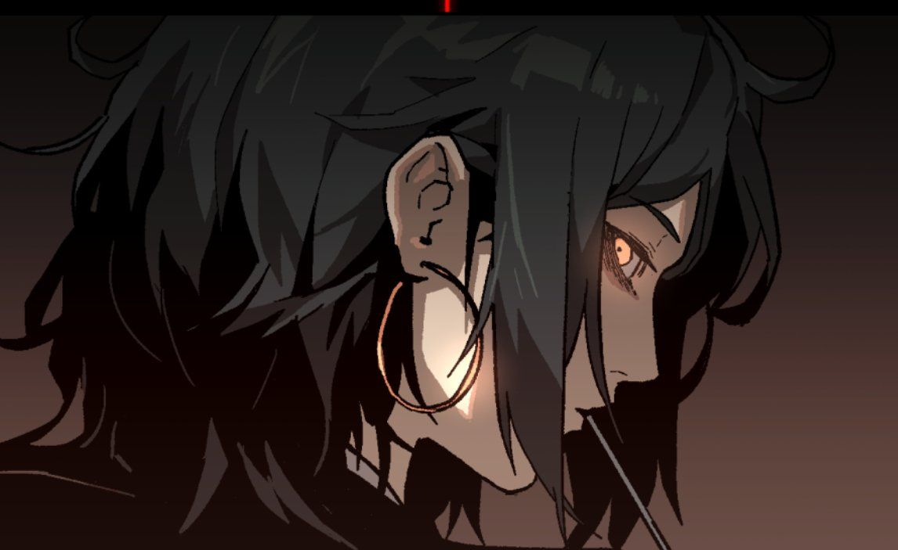
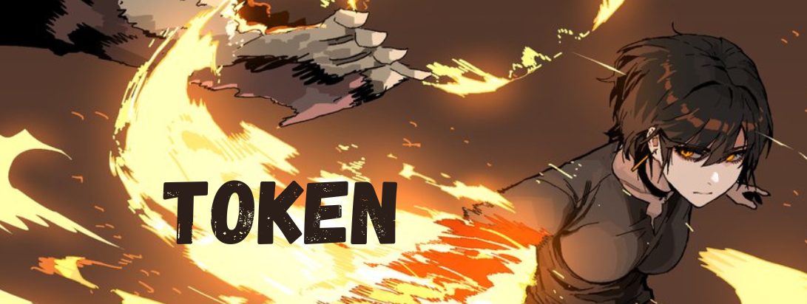

# Issahnya

Created: February 23, 2026 12:43 PM
Tags: Barbarian

### Token

Nome: Issahnya

Età: 37

Provenienza: Noxus

Occhi:  Rossi

Capelli:  Corvini

Razza: Reborn

### Aspetto

Il suo aspetto è stranamente simile a quello di una normale umana, nonostante la sua origine.
Nasconde infatti, ad eccezione degli occhi che sono di un acceso aracione, il suo vero aspetto, velandolo con un leggero stato di trucco la sua pelle grigia.
I capelli sono tenuti corti, non potendo ricrescere, anche per praticità durante un eventuale scontro.
Tiene sempre al collo un collare per non esporre una grande cicatrice nel punto in cui la sua testa è cucita assieme al resto del corpo.
Ha volumi abbastanza generosi, e un corpo tonico e atletico, non particolarmente alto dato che per un paio di centimetri non arriva al metro e settanta, coperto nel momento in cui arriva ad Arcamis da una camicia nera, e dei pantaloni del medesimo colore.

### Carattere

Dal carattere inizialmente diffidente e spigoloso, valuta a lungo con chi interfacciarsi sebbene non abbia paura di farlo.
Forse lo fa per non esporsi troppo, forse perchè non è sua abitudine fidarsi del prossimo, o forse per motivi più remoti.
è difficile vederla contenta o sorridente, e sebbene le piaccia il sangue anche nei momenti più concitati della battaglia sembra sofferente e costretta ad agire, se non del tutto priva di intendere e volere.
Tuttavia è altrettanto facile corromperla, bastano a volte poche e semplici attenzioni per imbuonirsela e far aprire una parte di se che tiene nascosta

https://open.spotify.com/playlist/5La5ZgeUwltXzHcH3puyjf?si=v9vp8RuJQ5yRMCgDaEhgDw

<aside>

sembrano canzoni messe a caso e infatti lo sono

</aside>

> 
>