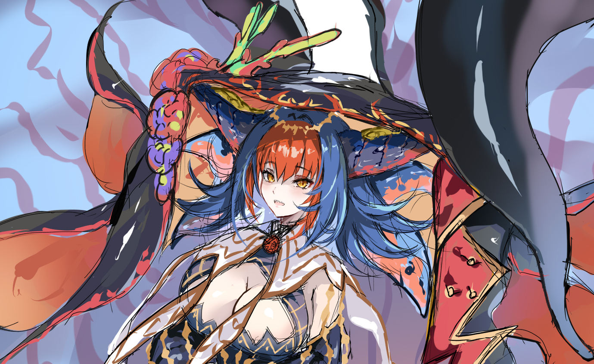

# Iza'Nahk

Created: February 19, 2026 10:00 PM
Tags: Sorcerer

Dall'aspetto che sfocia nella valle del perturbante, Iza'Nahk è una creatura che sembra avere tratti umani e un corpo che in un primo momento sembrano normali, sfociano però agli estremi in fattezze più simili a zampe e artigli di creature che è difficile definire altro se non di mostruosa natura. 
In aggiunta vi sono anche sul capo, tra quelli che sembrano capelli di colori inusuali, delle corna che non richiamano quelle di nessun animale convenzionale ma, proprio come zampe e artigli, sembrano ricadere in un qualcosa di mostruoso. 
In pieno contrasto con questi lati che non richiamano sicurezza in alcun modo, vi sono quelle parti umane che sembrano tutto l'opposto, i delicati lineamenti del viso che portano quel viso umano dalla pelle fin troppo pallida e candida ad avere un aspetto che ricade nella definizione di bello in maniera quasi fin troppo precisa, allo stesso modo anche il corpo sembra quello di una donna slanciata e che arriva oltre il metro e ottanta. 
Tutto questo viene contornato da vestiti estremamente piacevoli alla vista che coprono le spalle e avambracci con tessuti provvisti di fantasie che alternano colori chiari e scuri ad un apparente oro e che vanno poi a ricadere su tutto il corpo, il continuo poi che segue dalla schiena fin quasi ai piedi è una gonna che lascia scoperto solo il lato frontale in modo da non intralciare i movimenti di camminata e corsa, ed infine un telo sopra le corna che, data la forma di esse, cade sul capo formando un comodo ed effettivamente pratico copricapo che protegge in modo efficiente dal sole fin oltre le spalle. 
Oltre il viso che non sembra emanare un'eccessiva espressività, è possibile osservare come, tal volta, alcune emanazioni violacee compaiano attorno a lei, soprattutto in quei punti del corpo che richiamano quel lato apparentemente non umano.