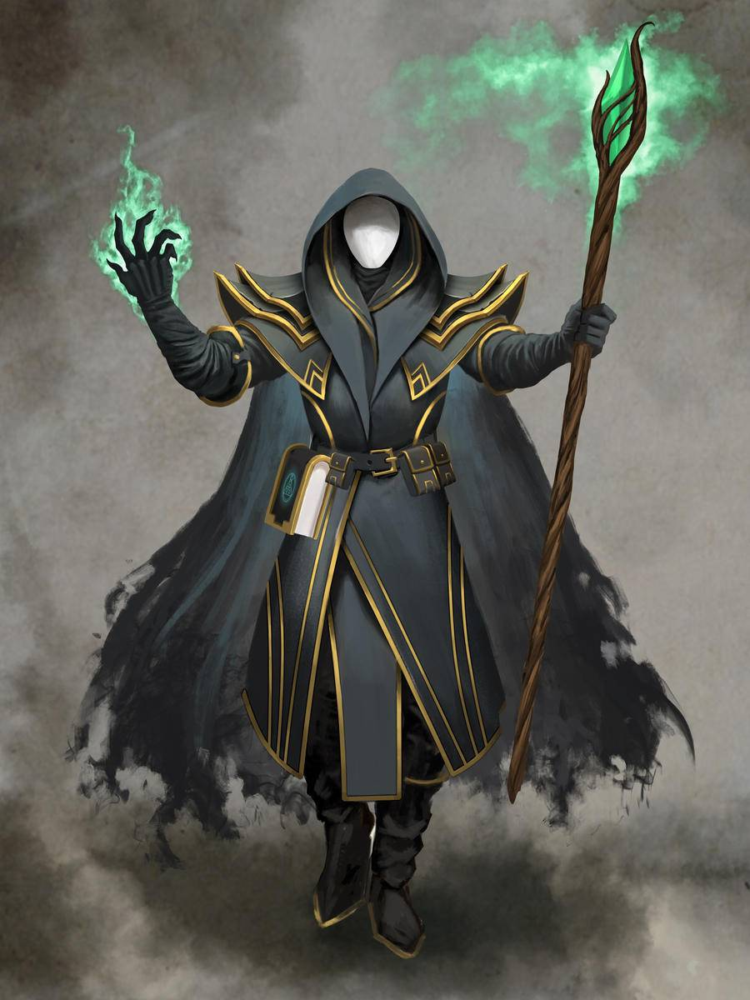

# Nebula

Created: March 10, 2026 2:07 PM
Tags: Warlock

Una particolare figura interamente coperta, Nebula è alto 1.80 m, con un lungo mantello nero che finisce in maniera quasi innaturale, perdendosi nell'etere. Al fianco tiene sempre il suo tomo e in mano ha un bastone con un cristallo verde luminoso in cima, più lì per aiutarsi a camminare che altro. La voce è profonda ma al tempo stesso lieve, che si perde in sospiri. Il volto è coperto da una maschera bianca che non lascia trapelare niente. Eppure, se uno ci si concentra, forse riesce a vedere almeno un... alone.

***"Levati di mezzo."**Mentre una nerastra nebbia e un alone verde lo avvolge, Nebula maledice il mimic davanti a se generando sotto di lui un sigillo arcano.

Poi, dalla sua mano, un'intensa luce dello stesso verde si forma, per poi venire sparata con una forza disumana, illuminando la stanza e annientando il mimic davanti a se.

3 20 nat di fila ragazzi.

Immagine generata dall'ia.*,

