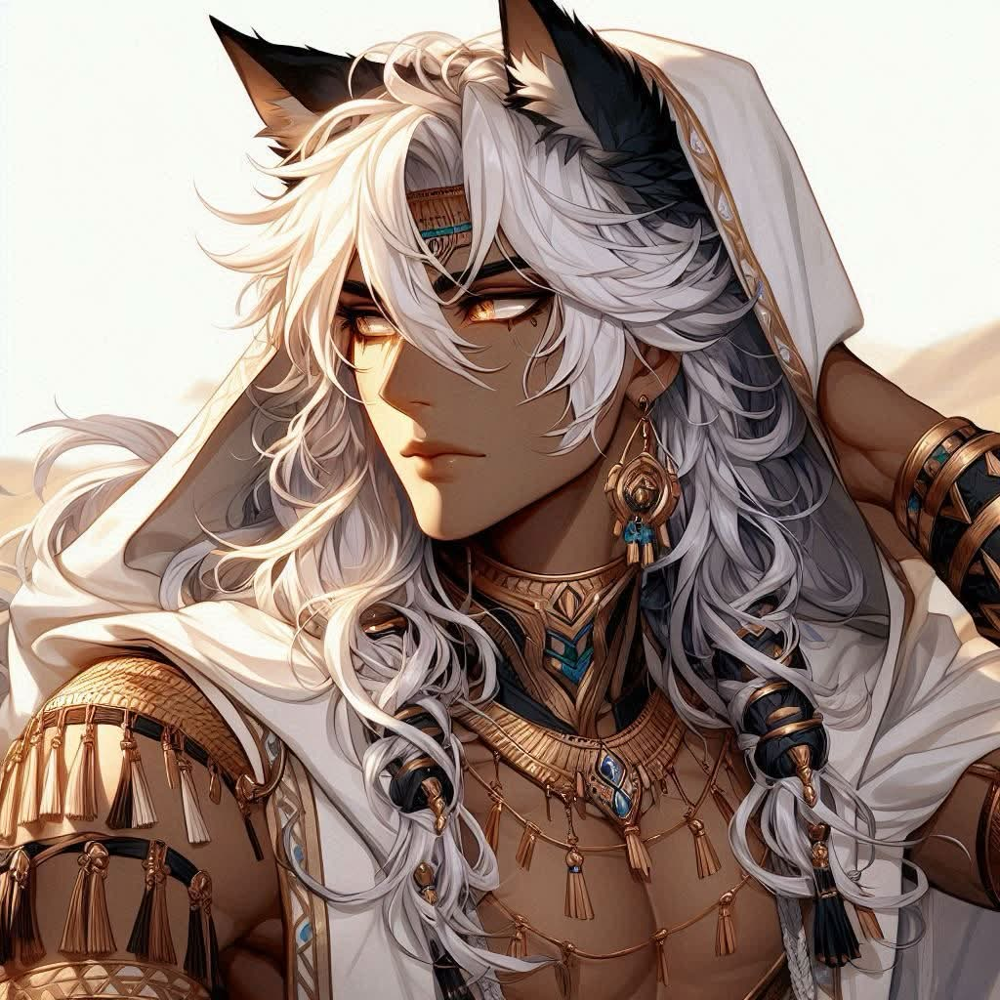
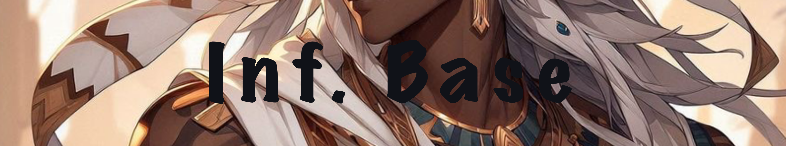
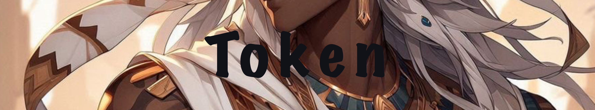
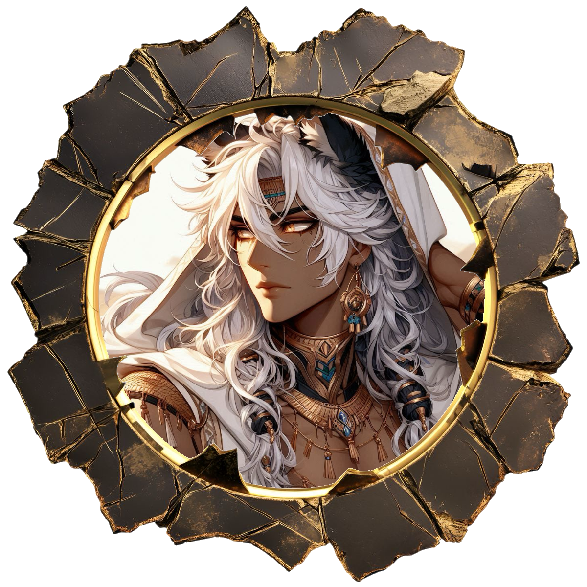
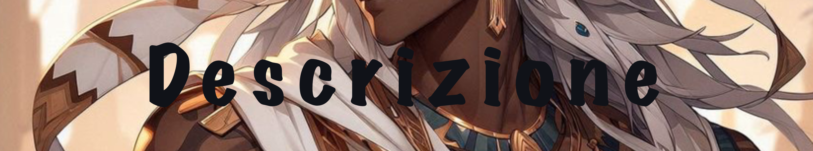
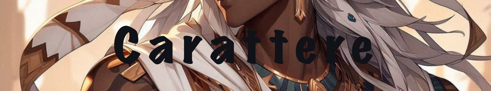
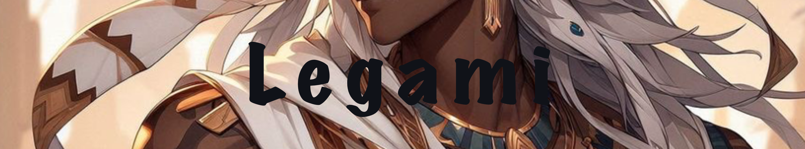

# Zelrer

Created: February 16, 2026 11:46 AM
Tags: Rogue

Nome: Zelrer

Età: 27 anni

Specie: Vastaya

Altezza: 1,87 m

Origine: Shurima

Occhi:  Ambra

Capelli:  Biondo Cenere

Carnagione: Olivastra

### Token

### Descrizione

Zelrer si presenta come un Vastaya dalla carnagione olivastro scuro, il frutto di anni di sole Shurimano.
Le sue origini sono evidenti dal vestito di drappi e ninnoli legati ad esso, che spesso copre un’armatura di pelle intarsiata da ninnoli e borchie.
Il volto dai tratti androgeni cozzano con il suo fisico asciutto e tonico.
Con se porta sempre una faretra, un arco corto ricurvo alle estremità e alcuni pugnali in fondine nei gambali del vestito esotico.
Gli occhi color ambra sotto il sole risplendono di luce, facendo sembrare di star guardare due sfere d’oro brillante.
I capelli biondo cenere si confondono con i drammi dell’abito che nelle giornate di sole porta a coprire il capo, probabilmente retaggio della sua vita prima di arrivare ad Arcanis.
Il suo corpo è rivestito di ninnoli, catenine, piccole pietre che rendono difficile a chi si fa rapire dal loro lieve tintinnio distogliervi lo sguardo.

### Carattere

Zelrer ha un carattere gioviale e socievole.
Difficile non trovarlo in una taverna a scommettere o giocare a dadi, carte o bere in compagnia.
“In fondo… il nettare della vita ha il sapore di vino e miele, no?”
Per quanto sia un ottimo commensale non gli si deve dire di non fare qualcosa, infondo a nessuno piace sentirsi dire che non ce la può fare, no?
In missione il suo volto cambia, il lavoro viene prima del piacere, per godersi a meglio il tempo libero é meglio darsi da fare prima

### Legami

# Amici e famiglia

- Eeidar (Padre e mentore)
- Calypso
- Sal’Rek
- Al’Rek
- Niti (Madre)
- Dagrez (Padre)
- Yukio
- Lillith

# Conoscenti:

- Yukio
- Puffy
- Lillith
- Puffy (Quasi amico)
- Pippo
- Mercer (il fra, l’uomo, ma per ora un buon conoscente)
- Nalca
- Nagiyori
- Alphard
- Thalir (se potesse lo ucciderebbe)
- Bjornhakar
- Zoe
- Kai’Reth (Di vista, non in buon occhio)
- A’valon (Meglio se gli sta distante…)
- Xitralk (un po’ viscido…)
- Ivarek
- Rehfaari
- Maeve (la conosce di vista)
- Issahnya (Pazza…)
- Iza’Nahk (non ha ancora capito bene che è una voidborn…)
- Valerius
- Sok’haanj (molto amichevole)
- Sarkhan (un fra)