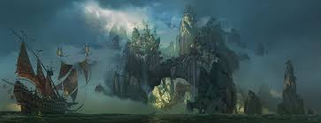
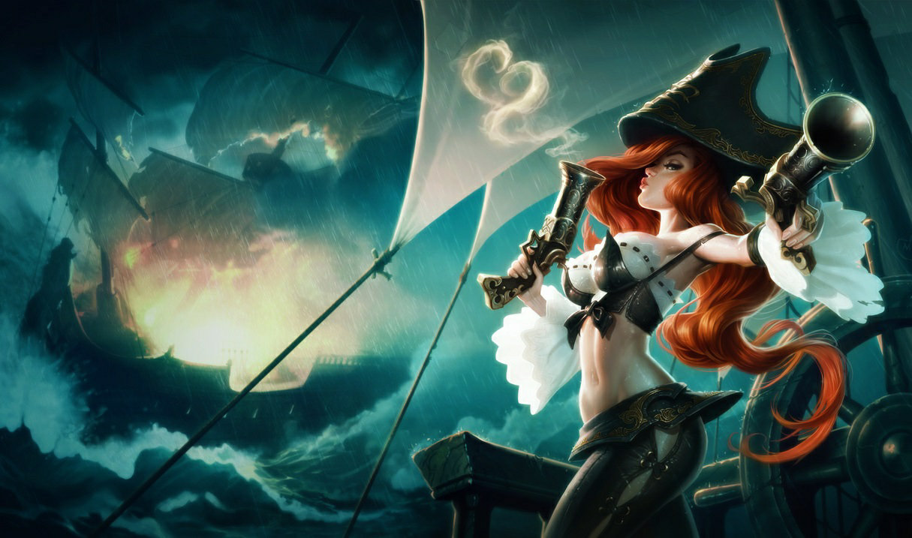
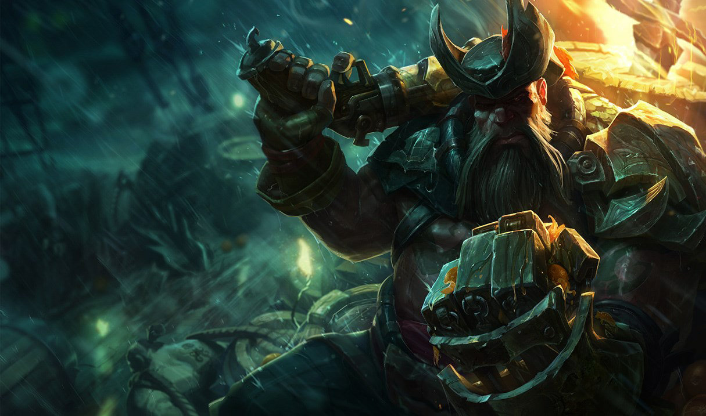

# Bilgewater

Created: January 28, 2026 10:26 PM

### Bilgewater (Sindacati Criminali)

<aside>

### Città Capitale:

Baia di Bilgewater

</aside>

---

### Quick menu

[Soldati di Fortune](Bilgewater%202f60274fdc1c8028a32ec4703f780bda.md)

[Uncini seghettati](Bilgewater%202f60274fdc1c8028a32ec4703f780bda.md)

Bilgewater è un rifugio per contrabbandieri, predoni e avventurieri spietati, dove le
fortune si fanno e si disfano in un attimo. Per coloro che cercano giustizia, debito o
resurrezione, Bilgewater rappresenta un nuovo inizio: nelle sue strade tortuose,
nessuno è tormentato dal proprio passato. È un crogiolo di culture, razze e gesta, vivo e
pulsante a ogni ora del giorno e della notte. Pur essendo incredibilmente pericolosa,
Bilgewater è anche ricca di opportunità, libera dalle catene del governo, delle
regolamentazioni e dei vincoli morali. Se possiedi le monete, quasi tutto può essere
comprato, dal favore di funzionari corrotti alla protezione dei signori del crimine locali.
Tuttavia, quando l’alba si leva, gli incauti vengono spesso trovati a galleggiare nel porto,
le borse vuote e la gola tagliata.

---

# FAZIONI

La baia pirata di **Bilgewater** ospita i più famigerati criminali armati di Aetherion. 

**Mercantilismo, saccheggi e pirateria** prosperano senza alcuna supervisione statale.

Al loro posto, la politica di Bilgewater è governata da **gang e consorterie**, costantemente in lotta tra loro per il potere.

Tribù indigene abitano le isole che circondano Bilgewater. Conosciuto come **Isole della Fiamma Blu** per la maggior parte degli stranieri di Valoran, l’arcipelago è una destinazione privilegiata per **commercio, pesca ed esplorazione**.

I **Buhru**, tuttavia, chiamano queste terre **Isole del Serpente**. Nei mari di Bilgewater, mostri si annidano negli abissi e **maree turbolente** inghiottono marinai ignari.

### **Bilgewater a colpo d’occhio**

**Demonimo:** Bilgewater, Bilgerat

**Descrizione:** Città portuale senza legge

**Governo:** Sindacati criminali

**Terreno:** Arcipelago tropicale

**Lingue:** Va-Nox, Buhru e altre lingue indigene

**Miti:** Kindred (Agnello & Lupo), Nagakabouros, Tahm Kench

**Livello tecnologico:** Medio

**Atteggiamento verso la magia:** Utilizzata

---

### *Soldati di Fortune*

---

> *“Qui fuori non esiste giustizia, se non la mia.”*
> 

Nonostante siano una ciurma relativamente recente, i **Soldati di Fortune** sono saliti rapidamente al potere a Bilgewater.

Dopo aver causato la caduta in disgrazia del Capitano Gangplank, cercano di mantenere il controllo tramite **spietata efficienza** e **astuti affari**.

I Soldati di Fortune presidiano la nave pirata **The Syren**, sotto la guida del **Capitano Sarah Fortune**.

### **Credenze:**

1. Usa **ogni strumento** a tuo vantaggio: negoziazione e fascino, ma soprattutto **armi e polvere da sparo**
2. Chiunque pensi di fare del male alla **Syren** affronta una **rapida punizione**

Il vecchio mondo di Bilgewater non può stare al passo con noi, quindi va **tenuto sotto il tallone**

**Allineamento:** Neutrale Malvagio

**Alleati:** Nessuno

**Nemici:** Uncini Seghettati; altre bande pirata di Bilgewater

### Obiettivi

- Mantenere il potere a Bilgewater nel nome del Capitano **Sarah Fortune**, nota anche come **Miss Fortune**

---

### *Uncini Seghettati*

---

**Allineamento:** Neutrale Malvagio

**Alleati:** Nessuno

**Nemici:** Soldati di Fortune; Ordine dell’Ombra; Noxus; altre bande pirata

**Obiettivi:** Riconquistare il potere a Bilgewater nel nome del Capitano Gangplank

> *“Brucerò tutto se non posso averlo.”*
> 

Storica banda di pirati, truffatori, razziatori e combattenti, gli **Uncini Seghettati** sono fedeli al capitano pirata **Gangplank**, noto anche come il **Flagello delle Acque Salate**.

Molti membri servono a bordo della sua nave, la **Dreadway**.

### **Credenze:**

1. Non bisogna quasi mai dimenticare, e **mai perdonare**
2. Una schiena voltata **merita un coltello**

Le nuove gang dei moli di Bilgewater devono

**imparare il loro posto**