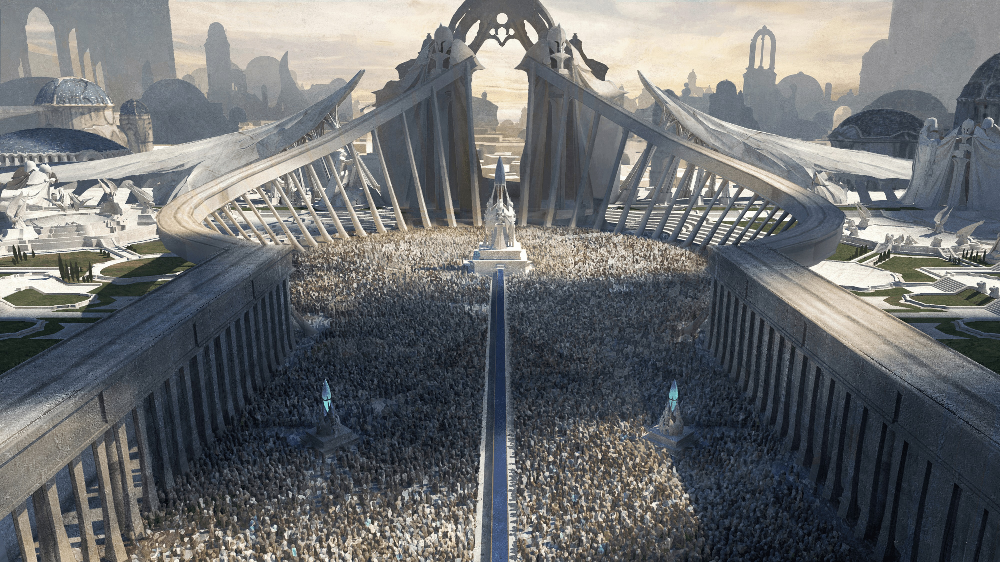
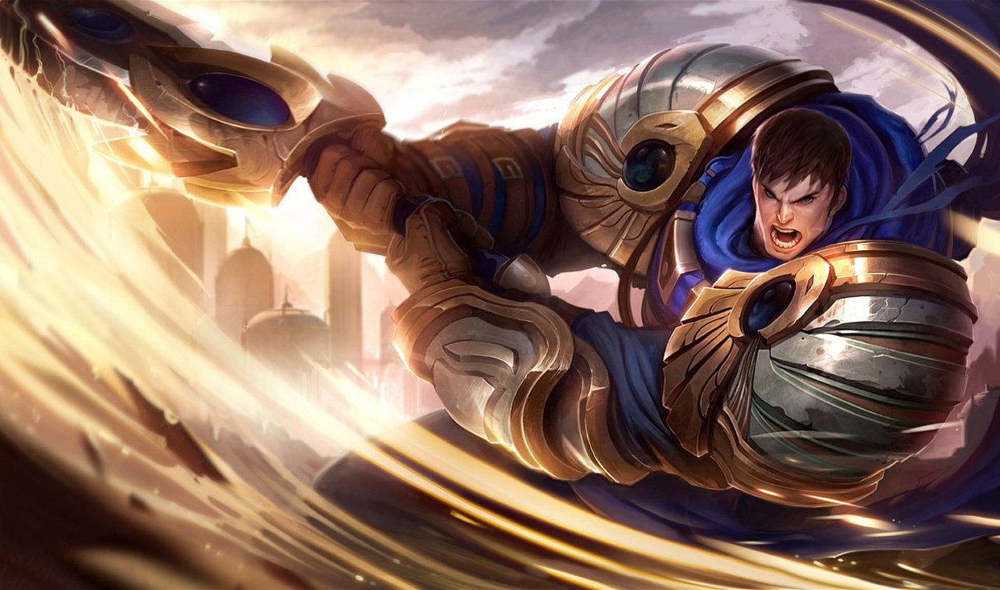
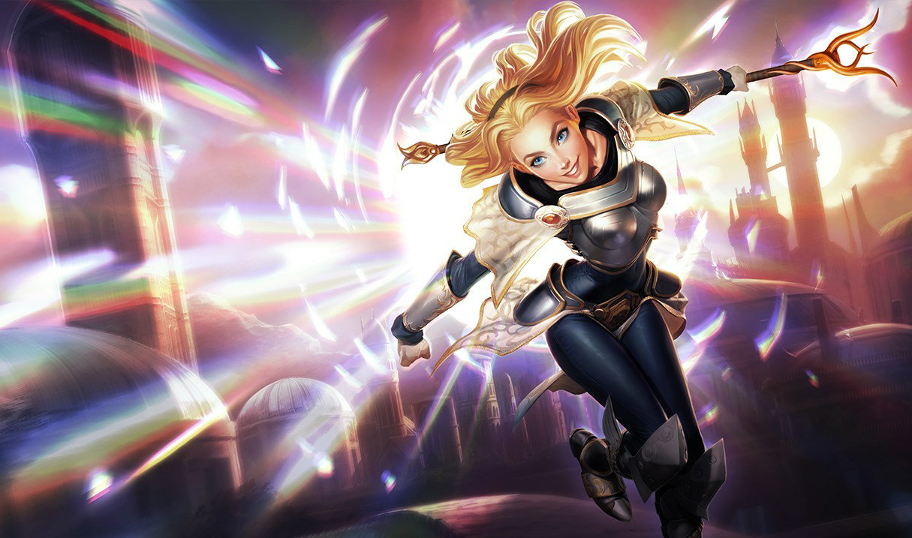
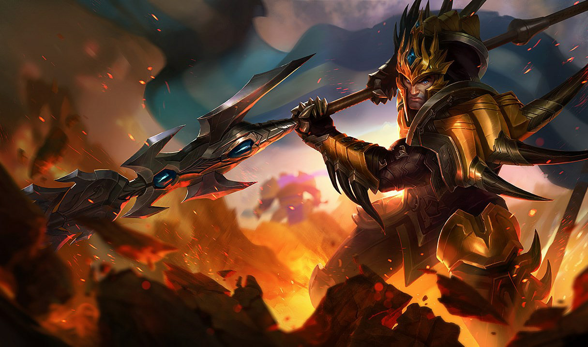
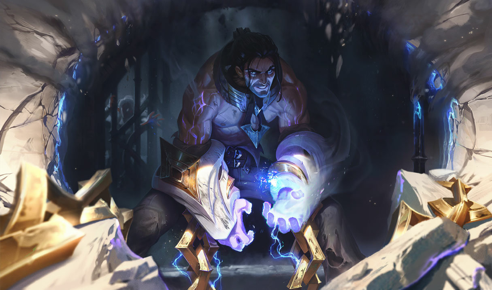

# Demacia

Created: January 28, 2026 10:27 PM

<aside>

### Città Capitale:

Grande Zeffira

</aside>

---

### Quick menu

[L’esercito di Demacia](Demacia%202f60274fdc1c80978456fbbcab56a7b7.md)

[Luminari](Demacia%202f60274fdc1c80978456fbbcab56a7b7.md)

[Cacciatori di maghi](Demacia%202f60274fdc1c80978456fbbcab56a7b7.md)

[Maghi esiliati](Demacia%202f60274fdc1c80978456fbbcab56a7b7.md)

### Demacia (Monarchia Feudale)

Regno forte e legale, con una prestigiosa tradizione militare, Demacia ha sempre
sostenuto con fervore gli ideali di giustizia, onore e dovere, ed è profondamente
orgogliosa della propria eredità culturale. Grazie a questi principi, questa nazione a
lungo autosufficiente è diventata sempre più isolazionista nel corso dei secoli recenti.
Coloro che abitano oltre i suoi confini rigidamente sorvegliati sono visti con crescente
sospetto, e molte famiglie hanno iniziato a trasferirsi altrove in cerca di protezione in
questi tempi incerti. Alcuni osano sussurrare che l’età dell’oro di Demacia sia ormai
terminata e che, se il popolo non sarà disposto ad adattarsi a un mondo che cambia
cosa che molti ritengono impossibile il declino del regno potrebbe essere inevitabile.

---

# FAZIONI

Nella parte occidentale del continente di **Valoran**, il longevo regno di **Demacia** regna saldo, fondato sui principi di **giustizia, orgoglio e dignità**. 

Con un esercito imponente e disciplinato, Demacia ha resistito a lungo alle avversità.

In effetti, la nazione nacque come **santuario contro la magia**, in seguito alle **Guerre delle Rune** di secoli fa.

Ma oggi Demacia è **assediata da sé stessa**. Lo Stato, storicamente, ha dichiarato la **magia come nemico**. 

Usando una risorsa naturale chiamata **petricite**, in grado di soffocare la magia, la monarchia demaciana **sorveglia, imprigiona e opprime** i maghi entro le proprie mura.

Queste pratiche controverse, unite a nuove tensioni sulla **successione al trono** e a politiche sempre più **isolazioniste**, stanno spingendo Demacia verso una **rivoluzione** — e una possibile **guerra civile**.

### **Demacia colpo d’occhio**

**Demonimo:** Demaciano

**Descrizione:** Orgoglioso regno militare

**Governo:** Monarchia feudale

**Terreno:** Campagne fertili

**Lingue:** Va-Nox, Demaciano

**Miti:** Kindred (Agnello & Lupo), il Protettore, la Dama Velata

**Livello tecnologico:** Medio

**Atteggiamento verso la magia:** Negazione

---

### **L’Esercito Demaciano**

---

> *“Vittoria per i nostri alleati, sconfitta per i nostri nemici, e giustizia per tutti.”*
> 

L’esercito di Demacia è il **paradigma nazionale di giustizia, onore e moralità**.

Rappresenta uno dei pilastri centrali della civiltà demaciana ed è incaricato di:

- proteggere la **monarchia** e le **famiglie nobili**;
- reprimere i **maghi** che potrebbero minacciare il trono;
- difendere il territorio da **invasioni esterne**.

Tutti i cittadini abili al servizio devono prestare **almeno tre anni** nell’esercito.

All’interno delle forze armate esistono **rami specializzati ed élite**, ciascuno con missioni specifiche:

- l’**Avanguardia Impavida** è la divisione più prestigiosa, incaricata degli obiettivi più pericolosi o cruciali per Demacia;
- I Ranger **Demaciani** operano come agenti di intelligence esterna, infiltrandosi oltre le linee nemiche per **spiare o eliminare** minacce ostili.

### **Credenze**

1. La morte è inevitabile; si può solo evitare la sconfitta
2. Combattere per la giustizia nel nome di Demacia
3. Vittoria per gli alleati, sconfitta per i nemici, giustizia per tutti
4. Quando Demacia avanza, scacciando gli avidi e gli egoisti sotto lo stendardo della giustizia, sappiamo chi siamo e per cosa combattiamo
5. Nella nostra marcia eterna dobbiamo sradicare il male ovunque cresca: **una sola erbaccia ignorata può corrompere l’intero giardino**

**Allineamento:** Legale Neutrale

**Alleati:** Arbormark (una piccola nazione al confine di Demacia); Monte Targon

**Nemici:** I maghi esiliati; Freljord; Noxus; Isole dell’Ombra

### Obiettivi

- Mantenere le leggi e la società demaciane;
- Difendere Demacia da invasioni;
- Proteggere la famiglia reale e la nobiltà.

---

### **Luminari**

---

**Allineamento:** Neutrale Buono

**Alleati:** Demacia

**Nemici:** I maghi esiliati; Noxus; Freljord; Isole dell’Ombra

### Obiettivi

- Aiutare poveri e malati;
- Proteggere Demacia;
- Sostenere i maghi e difenderli dalle leggi demaciane ingiuste.

> *“Per la giustizia e per tutte le cose luminose.”*
> 

Ufficialmente, gli **Illuminatori** sono un’organizzazione caritatevole che aiuta i bisognosi dentro e intorno a Demacia.

Alcuni membri operano apertamente nell’esercito, mentre altri servono come **volontari civili**.

In segreto, però, gli Illuminatori **accolgono e proteggono i maghi**, aiutandoli a nascondere i loro poteri e a sfuggire alla persecuzione. Alcuni Illuminatori vengono anche chiamati a **difendere i confini** demaciani.

### **Credenze**

1. Il mondo ha già visto abbastanza oscurità
2. Serve coraggio nella magia e nella luce
3. Un giorno non dovremo più negare chi siamo

---

### Cacciatori di Maghi

---

> *“Proteggere il nostro regno liberandolo dalla magia, sia all’esterno che all’interno.”*
> 

I **Cercatori di Maghi** sono la **forza di polizia principale di Demacia**, incaricata di far rispettare la legge demaciana: **individuare e controllare i maghi**.

Se necessario, possono **arrestare, imprigionare o persino giustiziare** gli utilizzatori di magia. Talvolta vengono anche chiamati a fungere da **guide e guardie temporanee** per ospiti di Demacia dotati di poteri magici.

I Cercatori di Maghi agiscono secondo i **decreti del trono**, perseguendo principi come **ordine e sicurezza**.

I loro ufficiali indossano una **mezza maschera di petricite**, chiamata **Marchio Grigio**. Questo simbolo rappresenta il loro ruolo e la loro autorità, oltre a **proteggerli dall’energia arcana**.

È interessante notare che i Cercatori di Maghi

**impiegano anche maghi**, in particolare coloro le cui abilità aiutano a **rintracciare la magia**.

Giurando fedeltà alla famiglia reale demaciana, questa è **l’unica organizzazione in cui è legale essere un mago**.

### **Credenze**

1. La morte è inevitabile; si può solo evitare la sconfitta
2. Combattere per la giustizia nel nome di Demacia
3. Vittoria per gli alleati, sconfitta per i nemici, giustizia per tutti
4. Quando Demacia avanza, scacciando gli avidi e gli egoisti sotto lo stendardo della giustizia, sappiamo chi siamo e per cosa combattiamo
5. Nella nostra marcia eterna dobbiamo sradicare il male ovunque cresca: **una sola erbaccia ignorata può corrompere l’intero giardino**

**Allineamento:** Legale Neutrale

**Alleati:**  Demacia

**Nemici: I maghi esiliati**

### Obiettivi

- Mantenere le leggi e la società demaciane;
- Difendere Demacia da invasioni;
- Proteggere la famiglia reale e la nobiltà.

---

### Maghi esiliati

---

**Allineamento:** Caotico Buono – Caotico Neutrale

**Alleati:** Freljord (Artiglio dell’Inverno)

**Nemici:** Demacia (in particolare l’Esercito Demaciano e i Cercatori di Maghi)

### Obiettivi

- Ribellarsi all’oppressione demaciana contro i maghi
- Liberare i maghi in catene
- Cercare alleati che sostengano la loro causa

> *“Chi aspetta di essere liberato non merita la libertà.”*
> 

Sostenendo **Sylas di Dregbourne**, questo piccolo ma determinato gruppo di **maghi e stregoni** è fuggito da Demacia.

Nel tentativo di contrastare l’oppressione del regno contro gli utilizzatori di magia, questi esuli hanno subito **le peggiori forme di sottomissione demaciana**.

Di conseguenza, la loro ideologia è diventata

**radicale** e spesso **militante**.

Sono considerati **nemici dello Stato di Demacia**.

### **Credenze**

1. La tradizione è un sostegno per menti deboli
2. Chi cerca di sottomettere gli altri è un uomo che deve morire
3. Una volta conosciuta la verità, non si può continuare a vivere nella menzogna

---