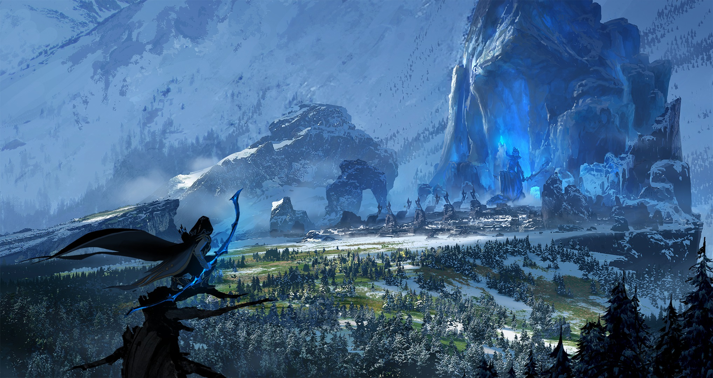
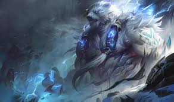

# Frejlord

Created: January 28, 2026 10:28 PM

### Freljord (Matriarcato Tribale)

<aside>

### Città Capitale:

Cittadella della Frostguard

</aside>

---

### Quick menu

[Avarosa](Frejlord%202f60274fdc1c8053a5adc27a85ffd763.md)

[Artigli d’inverno](Frejlord%202f60274fdc1c8053a5adc27a85ffd763.md)

[Frostguard](Frejlord%202f60274fdc1c8053a5adc27a85ffd763.md)

[Ursidi](Frejlord%202f60274fdc1c8053a5adc27a85ffd763.md)

Il Freljord (pronunciato FERL-yord) è una terra dura e implacabile. Fieramente
indipendenti, i suoi abitanti nascono guerrieri, temprati da tundre ghiacciate.
Mentre le tribù mantengono tradizioni e credenze antiche, tre clan principali sono
coinvolti in una guerra a tre fazioni che determinerà il futuro della nazione: le Tre Leggi
d’Inverno.
-Gli Avarosiani seguono il sogno di un futuro unificato, profetizzato da una giovane
idealista.
-I Frostguard venerano il potere arcano di una strega enigmatica.
-I Wintersclaw onorano le tradizioni brutali che hanno garantito la sopravvivenza.
Il Freljord è inoltre l’unico luogo in cui si dice possa essere trovato il Ghiaccio Vero (True
Ice).

---

# FAZIONI

Miglia e miglia di **montagne ghiacciate** e **abissi congelati** compongono i paesaggi spietati del Freljord.

Ancor più pericolose sono le **politiche e le guerre** delle tribù freljordiane, che trascinano ciclicamente il popolo in periodi di pace instabile o in **sanguinosi conflitti**.

Decine di tribù popolano il Freljord, ognuna in lotta per la **sopravvivenza o il potere**.

Sebbene le tribù siano diverse per cultura e ideologia, è possibile fare alcune generalizzazioni: le tribù umane tendono a essere **matriarcali**, guidate da una leader chiamata **Madre Guerriera**, e venerano **una o più divinità del Freljord**.

### **Freljord a colpo d’occhio**

**Demonimo:** Freljordiano

**Descrizione:** Terra gelida e inospitale

**Governo:** Matriarcato tribale

**Terreno:** Tundra ghiacciata

**Lingue:** Va-Nox, Freljordiano

**Miti:** Dei del Freljord (tra cui **Anivia, Ornn e Volibear**), **Kindred** (Agnello & Lupo, chiamati **Farya & Wolyo**), **Culto delle Tre Sorelle**

**Livello tecnologico:** Basso

**Atteggiamento verso la magia:** Venerata

---

### Avarosa

---

> *“Vittoria per i nostri alleati, sconfitta per i nostri nemici, e giustizia per tutti.”*
> 

Guidata dalla **Madre Guerriera Ashe**, la tribù di **Avarosa** valorizza **pace e unità**, in netto contrasto con le tradizioni freljordiane di guerra e razzie.

Essi onorano l’eredità di **Avarosa**, una delle **Tre Sorelle** le cui antiche leggende hanno plasmato fede e società del Freljord.

La nascita degli Avarosiani moderni deriva da una storia di **tradimento, morte e rinascita**.

La tribù originaria fu attaccata e sterminata mentre Ashe era lontana alla ricerca del **Trono di Avarosa**. In seguito, Ashe salvò una tribù chiamata **Ebrataal** dall’ira della sua stessa sorella di battaglia, **Sejuani**.

Separandosi dalla violenza della tribù di Sejuani, Ashe si affermò come leader di una **nuova via di vita**.

Adottò gli Ebrataal come suo popolo, riformandoli nella **nuova tribù di Avarosa**.

Negli ultimi anni, gli Avarosiani sono riusciti a unire **clan minori** tramite **tregue e patti reciproci**.

### **Credenze**

1. Le tribù del Freljord condividono lo stesso sangue e **possono essere unite**
2. **Misericordia e diplomazia** sono forze, non debolezze
3. La violenza va usata solo come **difesa o ultima risorsa**

.jpg)

**Allineamento:** Legale Buono

**Alleati:** **Tryndamere**, il Re Barbaro; varie tribù freljordiane (Ebrataal, Vene di Ghiaccio, Neve Rossa, Spaccapietre, Seguaci della Neve)

**Nemici:** Artiglio d’Inverno;Frostguard

### Obiettivi

- Unire il Freljord sotto un vessillo di **pace e cooperazione**;
- Onorare gli insegnamenti di Avarosa

---

### **Artiglio d’Inverno**

---

.jpg)

**Allineamento:** Legale Neutrale

**Alleati:**  **Ursidi**

**Nemici:** **Avarosa**; **Frostguard**

### Obiettivi

- Mantenere guerra, saccheggi e razzie che hanno reso forte il Freljord;
- Dominare le tribù più deboli; scacciare forze noxiane, demaciane o freljordiane che minacciano il loro stile di vita

> *“Siamo il grido di guerra del vento, siamo la forza delle montagne.”*
> 

Aggirandosi tra le tempeste di neve del Freljord settentrionale, l’**Artiglio d’Inverno** incarna le pratiche tradizionali di **nomadismo e guerra**.

Guidati dalla temprata **Sejuani**, i membri dell’Artiglio d’Inverno sanno che la **forza è essenziale** per sopravvivere nel Freljord; debolezze come compromesso o gentilezza **non hanno posto** tra le loro fila.

### **Credenze**

1. La sopravvivenza è privilegio dei forti; la morte è il destino dei deboli
2. Il Freljord deve essere governato tramite **dominazione**, non diplomazia
3. La nostra sopravvivenza persiste attraverso **ogni mezzo necessario**

---

### **Frostguard**

---

> *“Così tanti segreti sepolti nel ghiaccio. Questo mondo ha dimenticato il vero potere.”*
> 

In apparenza, i Frostguard attraversano il Freljord come **sacerdoti, chierici e veggenti**, offrendo guarigione e fede.

Essi diffondono la religione del **Culto delle Tre Sorelle**, un’antica dottrina che **rinnega gli antichi dei del Freljord**.

Ma nell’estremo nord del Freljord, dove le distese ghiacciate sono davvero **impenetrabili**, i Frostguard praticano una **segretezza assoluta**.

La loro base, la **Cittadella dei Frostguard**, è nascosta in profondità dietro **cortine bianche di neve e tempesta**, impossibile da trovare senza conoscere i segreti per attraversare quei territori ostili.

All’interno delle mura della Cittadella abbondano i misteri, e persino i seguaci più devoti potrebbero **ignorare la vera natura della propria tribù**.

La loro leader, una **misteriosa Strega del Ghiaccio**, intende mantenere tutto nell’ombra.

Dalla sua fortezza congelata, ordina la **distruzione segreta delle prove** legate agli antichi dei e la **persecuzione degli eretici**.

I suoi **sciamani e predicatori** viaggiano per il Freljord portando guarigione, ma, cosa più importante, **raccogliendo informazioni** sull’ascesa e la caduta delle altre tribù che potrebbero minacciare le sue narrazioni.

Il compito più vitale e riservato, affidato solo ai più fidati, sembra essere la **raccolta del Vero Ghiaccio e dei Figli del Gelo** in grado di brandirlo.

A cosa servano davvero… **solo lei lo sa**.

### **Credenze**

1. Solo i Frostguard conoscono i **veri pericoli del Freljord**, e la terra starebbe meglio sotto il nostro dominio
2. Guerre e paci sono tentativi frivoli di potere; le altre tribù del Freljord ci sono **inferiori**
3. Il controllo si ottiene meglio tramite **inganno, sabotaggio e sovversione**, come un **gelo lento e strisciante**

.jpg)

**Allineamento:** Neutrale Puro – Neutrale Caotico

**Alleati:**  **Trundle** e le sue bande di troll

**Nemici: Avarosa**; **Artiglio dell’Inverno**; **Ursidi**

### Obiettivi

- Proteggere e mantenere la fede nel **Culto delle Tre Sorelle**
- Minare il falso potere degli **dei del Freljord**
- Raccogliere **Vero Ghiaccio** e tutti i **Figli del Gelo** per servire la Cittadella dei Frostguard e la Strega del Ghiaccio

---

### **Ursidi**

---

**Allineamento:** Caotico Buono – Caotico Neutrale

**Alleati:** Freljord (Artiglio dell’Inverno)

**Nemici:** Demacia (in particolare l’Esercito Demaciano e i Cercatori di Maghi)

### Obiettivi

- Servire i desideri e i capricci di **Volibear**, il dio-spirito dell’orso
- Riportare il Freljord all’**era degli dei**, abbattendo le civiltà attuali

> *“Che la tempesta segua le mie orme.”*
> 

Devastando le frontiere settentrionali del Freljord, gli **Ursidi** vivono nel culto dello **spirito divino Volibear**.

Tribù di **cacciatori e sciamani**, gli Ursine sono profondamente connessi ai modi **selvaggi, naturali e animistici** del Freljord antico.

Tutti gli Ursidi sono **Camminatori dello Spirito**: individui capaci di **mutare forma animale**.

Nel culto dello spirito della tempesta **Volibear**, questi Camminatori assumono la **forma dell’orso**.

Sintonizzati con le tradizioni più brutali e violente del Freljord, gli Ursidi vedono le guerre attuali come **deboli e addomesticate** in confronto.

Volibear desidera attivamente il **massacro delle ere passate**, quando dei e spiriti **versavano sangue apertamente sulla neve bianca**, e i suoi seguaci rispondono con devozione alla sua **chiamata antica e feroce**.

### **Credenze**

1. Il grande **Volibear**, giudice degli uomini e portatore delle tempeste, guida i nostri sentieri selvaggi
2. Il popolo del Freljord ha dimenticato la **violenza indomabile**, e noi gliela ricorderemo
3. La **forma animale** è più sacra di quella umana, scegliamo di restare **selvaggi**

---