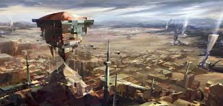

# Icathia

Created: January 28, 2026 10:28 PM

<aside>

### Città Capitale:

N/A

</aside>

---

### Icathia

Un tempo stato vassallo ribelle dell’antica Shurima, Icathia è ora una distesa sterile e
proibita. Eppure, tra le sue rovine, gli orrori indicibili del Vuoto iniziano a muoversi di
nuovo. Alcuni gruppi provenienti da Targon, Shurima e Ixtal si sono uniti sotto lo
stendardo di Icathia unita, tentando di creare un’ultima linea di difesa per impedire
l’ascesa del Vuoto. Hanno ricostruito la loro capitale e ospitano una popolazione
considerevole, ma la città è costantemente sotto attacco.