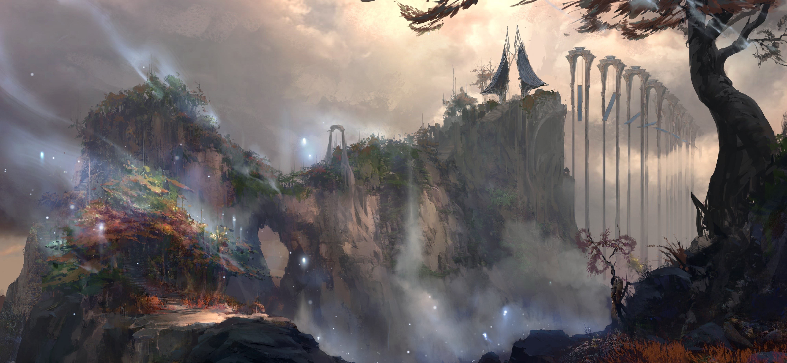
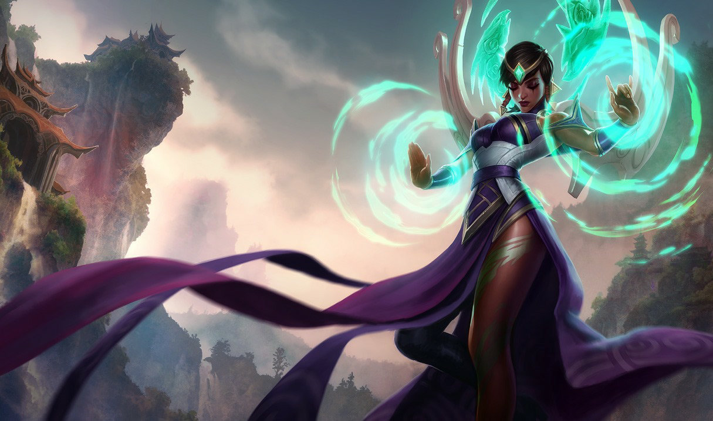
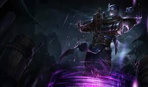
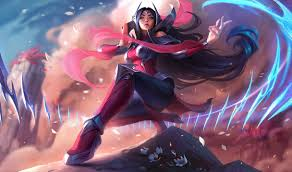
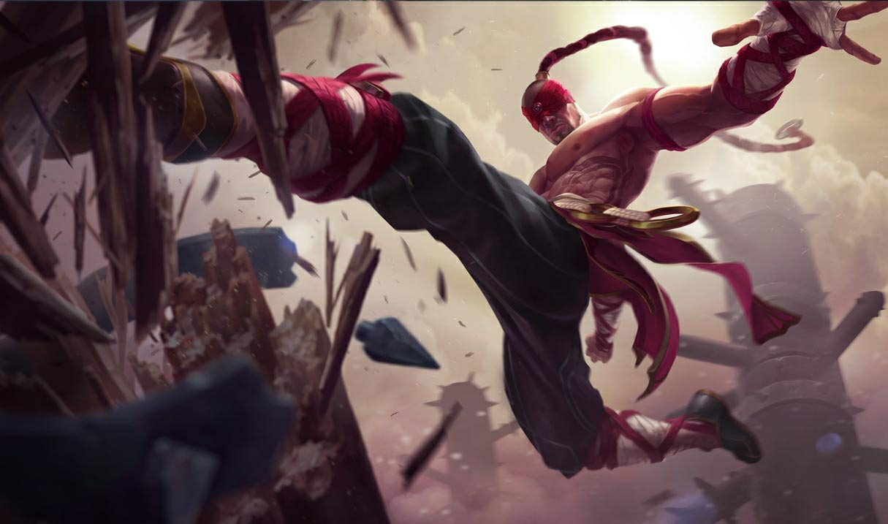

# Ionia

Created: January 28, 2026 10:28 PM

### Ionia (Province Regionali)

<aside>

### Città Capitale:

Ionia City (contesa)

</aside>

---

### Quick menu

[Hirana](Ionia%202f60274fdc1c80289c8ee157304bc67e.md)

[Kinkou](Ionia%202f60274fdc1c80289c8ee157304bc67e.md)

[Confraternita Navori](Ionia%202f60274fdc1c80289c8ee157304bc67e.md)

[Ordine dell’Ombra](Ionia%202f60274fdc1c80289c8ee157304bc67e.md)

[Ordine Shojin](Ionia%202f60274fdc1c80289c8ee157304bc67e.md)

Ionia, chiamata nella nomenclatura originaria vastaya le Prime Terre, è una regione di
ineguagliabile bellezza e magia naturale. I suoi abitanti vivono in insediamenti sparsi tra
il vasto arcipelago, come popolo spirituale che cerca di vivere in armonia ed equilibrio
con il mondo. Esistono molti ordini e sette a Ionia, ciascuno con il proprio cammino
spesso in conflitto e i propri ideali. Autosufficiente e isolazionista, Ionia è rimasta
largamente neutrale nelle guerre che hanno devastato Valoran per secoli… fino
all’invasione di Noxus. Questa brutale occupazione ha costretto Ionia a riconsiderare il
proprio posto nel mondo. Come reagirà e quale futuro seguirà Ionia rimane incerto;
tuttavia, l’ostilità verso Noxus ha portato a una crescente militarizzazione e vigilanza, e
una sete per le arti oscure comincia a emergere.

---

# FAZIONI

Storicamente terra di **equilibrio naturale e spirituale**, Ionia ospita numerosi popoli, villaggi e scuole di pensiero sparsi nel suo arcipelago.

Un’energia **selvaggia e ultraterrena** scorre liberamente nei paesaggi ioniani, e per questo la cultura e la vita quotidiana si sono evolute attorno alla **magia della terra stessa**. Essendo la culla dei **Vastaya**, Ionia custodisce numerosi **siti sacri** e **portali verso il mondo degli spiriti**.

Per secoli, Ionia ha vissuto in **neutralità e isolamento**. Il governo è frammentato tra comunità locali, con poteri provinciali, monasteri e ordini che sovrintendono le regioni circostanti.

Tuttavia, la **guerra e l’invasione di Noxus** hanno lasciato Ionia profondamente **lacerata**. Alcune potenze sono state annientate dalla colonizzazione; altre sono sorte dalle rovine del conflitto, ciascuna con una propria filosofia su come **ricostruire e riallineare Ionia** ai propri ideali.

### **Ionia a colpo d’occhio**

**Demonimo:**  Ioniano

**Descrizione:** Le Prime Terre

**Governo:** Province regionali

**Terreno:** Magico (variegato)

**Lingue:** Va-Nox, Ioniano, Vastayano

**Miti:** Akana, Azakana e Kanmei (demoni/spiriti); **Kindred** (Agnello & Lupo, chiamati **Ina & Anin** in Ionia)

**Livello tecnologico:** Basso

**Atteggiamento verso la magia: Armonizzare**

---

### **Hirana**

---

> *“L’istinto ferale guida il nostro pugno.”*
> 

Con base a Ionia nord-orientale, i monaci dell’**Ordine Hirana** cercano **armonia interiore e crescita spirituale**. Custodi di generazioni di **pacifismo**, praticano l’**imparzialità nel conflitto** e l’**autodisciplina** come filosofia personale.

Traggono significato e scopo dal **mondo naturale**, flora, fauna e spiriti.

Tuttavia, quando sono costretti ad agire, come durante l’**invasione noxiana**, difendono i loro monasteri con **notevole abilità marziale**.

### **Credenze**

1. Tutti i conflitti possono essere risolti guardando **dentro sé stessi**
2. Pace interiore e pace con la natura sono **inseparabili**
3. La ricerca della forza fisica deve accompagnarsi alla **comprensione spirituale**

**Allineamento:** Legale Buono

**Alleati:** Ordine Shojin

**Nemici:** Noxus; Confraternita Navori; Ordine dell’Ombra

### Obiettivi

- Mantenere pace e armonia spirituale in Ionia;
- Collaborare con altri monasteri pacifisti per diffondere gli insegnamenti ioniani

---

### **Kinkou**

---

**Allineamento: Legale Neutrale**

**Alleati:**   **Xan Irelia**

**Nemici:** Noxus; Confraternita Navori; Ordine dell’Ombra

### Obiettivi

- Mantenere l’equilibrio spirituale di Ionia intervenendo quando umani e spiriti entrano in conflitto;
- Proteggere Ionia da invasori e minacce esterne

> *“Equilibrio in ogni cosa.”*
> 

**Equilibrio, ordine e moderazione**: i **Kinkou** incarnano questi principi per mantenere l’armonia tra il **mondo fisico** e quello **spirituale**.

Tra le fazioni più antiche e influenti di Ionia, i Kinkou hanno per generazioni **osservato e viaggiato nel velo tra i reami**.

Sono spesso chiamati come **mediatori** negli affari soprannaturali e nei conflitti. Operano soprattutto nell’**Ionia centrale**, amministrando templi e santuari.

La guida dei Kinkou si fonda su **tre figure chiave**:

- l’**Occhio del Crepuscolo**, capo supremo dell’ordine (attualmente **Shen**), che assunse il titolo dopo la morte di suo padre **Kusho**, ucciso da **Zed**, ex accolito Kinkou e fondatore dell’**Ordine dell’Ombra**;
- il **Cuore della Tempesta**, ruolo attualmente ricoperto dal **Kennen** immortale;
- il **Pugno dell’Ombra**, terza guida dell’ordine.

Insieme, queste tre figure decidono le migliori linee d’azione e diramano ordini tra i clan Kinkou, ponendo **neutralità ed equità** sopra ogni altra cosa.

### **Credenze**

1. Gli spiriti oltre il nostro reame e i popoli del mondo possono vivere in **armonia**
2. I nostri sentieri trascendono la distinzione tra **bene e male**
3. La giustizia si raggiunge quando si restituisce **occhio per occhio**

---

### **Confraternita Navori**

---

> ***“Come l’albero brucia, così bruciamo noi. Elimina il nemico. La calma è l’oceano prima della tempesta.”***
> 

Clan radicale di **combattenti e mercenari**, la **Confraternita Navori** usa **forza e terrore** per ottenere potere in Ionia.

È un gruppo di recente formazione, nato da **estremisti militanti** durante l’invasione e l’occupazione noxiana.

Il loro obiettivo finale è **rafforzare la presenza offensiva di Ionia**, unificando tutte le province ioniane sotto un **unico potere militare**.

La Confraternita è disposta a usare **misure e metodi senza compromessi**, come l’arruolamento forzato o l’esecuzione dei dissidenti, in nome del **nazionalismo ioniano**.

### **Credenze**

1. I nostri nemici hanno usato violenza estrema contro di noi, e dobbiamo **rispondere allo stesso modo**
2. Le vie del pacifismo ioniano appartengono al passato
3. Tutti coloro che si definiscono ioniani devono unirsi alla nostra **crociata**

**Allineamento:** Caotico Neutrale – Caotico Malvagio

**Alleati:**  Nessuno

**Nemici: Noxus; Ordine Hirana; Kinkou; Ordine dell’Ombra; Ordine Shojin; Xan Irelia**

### Obiettivi

- Creare un **potere militare unico** in Ionia;
- Vendicarsi violentemente di Noxus per guerre e soprusi;
- Consolidare il potere eliminando le fazioni rivali

---

### **Ordine dell’Ombra**

---

.jpg)

**Allineamento:** Caotico Neutrale

**Alleati: Nessuno**

**Nemici:**  Noxus; Kinkou; Confraternita Navori; ribellioni Vastaya

### Obiettivi

- Creare una forza **militare unificata** per difendere Ionia;
- Raggiungere i propri scopi tramite **magia d’ombra** e magia naturale ioniana;
- Eliminare in silenzio chi si oppone o minaccia Ionia

> ***“Abbraccia le ombre, trova la verità.”***
> 

Attingendo a una **magia oscura e potentissima** che domina i deboli di volontà, l’**Ordine dell’Ombra** opera attraverso **assassinio e furtività**.

Il loro potere deriva dalle **Lacrime dell’Ombra**, una sostanza che si forma naturalmente come residuo dell’eccessivo flusso di magia in Ionia.

In grandi quantità, queste Lacrime sono **estremamente pericolose**, capaci di sopraffare e corrompere chi è mite o privo di volontà.

Per questo motivo, l’Ordine dell’Ombra accoglie solo individui capaci di **resistere al controllo**, pronti a **sacrificare sé stessi e la propria passività** nel nome di Ionia.

Un assassino chiamato **Zed** fondò l’Ordine dell’Ombra dopo aver **rinnegato il suo posto nei Kinkou**.

Convinto che Ionia avesse bisogno di azioni più **radicali e rivoluzionarie** per combattere i Noxiani, Zed ruppe con l’equilibrio predicato dai Kinkou.

A causa di questo tradimento e dell’odio che ne seguì, dettagli noti solo ai leader dei Kinkou e dell’Ordine dell’Ombra, le tensioni tra i due gruppi furono (e sono) **profonde e insanabili**.

Dopo la guerra con Noxus, l’Ordine dell’Ombra ha mantenuto la propria **ideologia severa e inflessibile**.

Nel perseguire l’unificazione ioniana, ritengono necessario **sfruttare tutte le risorse di Ionia**, incluse quelle naturali e magiche, pratica osteggiata dalla maggior parte dei Vastaya.

L’Ordine lavora verso una **militarizzazione e mobilitazione** dell’isola, idealmente basata su una grande forza segreta che opera dalle ombre, tramite **sovversione e punizioni silenziose**.

A Ionia, l’Ordine dell’Ombra è conosciuto come **Yanlèi**.

### **Credenze**

1. È nostro dovere e diritto usare **tutta la magia di Ionia** per difenderla, anche quella considerata tabù o sacra
2. Operare **dalle ombre**, con morte e violenza come strumenti
3. L’assassinio di uno può essere necessario per **salvare molti**

---

### **Ordine Shojin**

---

> *“Il drago ha incendiato il mio sentiero. Io mi limito a percorrerlo.”*
> 

Monaci inflessibili e **maestri di arti marziali**, i membri dell’**Ordine Shojin** cercano **armonia interiore** e **resilienza esteriore**, onorando le tradizioni ioniane di **pace**.

Gli accoliti dello Shojin spingono **mente e corpo oltre i propri limiti**, praticando disciplina estrema e talvolta **autopunizione**, nella ricerca dell’illuminazione.

Durante la guerra contro Noxus, il **Monastero Shojin** fu distrutto e poi ricostruito.

Il monaco e maestro **Lee Sin** riuscì a salvarlo incarnando lo **spirito del Drago**; nel farlo, demolì il tempio stesso.

Ciononostante, dimostrò la forza spirituale degli insegnamenti Shojin e successivamente **assistette alla ricostruzione**.

Le arti marziali Shojin ruotano attorno alla **forma del Drago**, combinando movimenti potenti e affilati con **precisione e grazia**.

I leader dell’Ordine incarnano ciascuno un aspetto del Drago:

- **Occhio del Drago**
- **Corna del Drago**
- **Artigli del Drago**
- **Scaglie del Drago**
- **Coda del Drago**

Questi membri operano in sinergia per rappresentare e trasmettere gli **Insegnamenti del Drago**, elencati di seguito.

### **Credenze**

1. Lo studente deve **ascoltare con concentrazione**, poiché il Drago ruggì i primi suoni e benedisse i giovani spiriti con il dono della magia
2. Lo studente deve **agire con compassione**, poiché il Drago nutrì le Prime Terre con calore e vita
3. Lo studente deve **pensare con chiarezza**, poiché il Drago trascina il sole nei cieli e rivela il mondo attorno a noi
4. Lo studente deve **impegnarsi con tutte le sue forze**, poiché il Drago trasse la terra da sotto le onde e ci diede una casa
5. Lo studente deve **muoversi con grazia**, poiché il respiro del Drago creò vento e onde, portando movimento nel mondo

**Allineamento:** Legale Buono

**Alleati:**  Ordine Hirana

**Nemici:  Noxus; Confraternita Navori; Ordine dell’Ombra**

### Obiettivi

- Cercare perfezione e comprensione di **mente, cuore e corpo**;
- Difendere Ionia e le tradizioni ioniane da chi porta distruzione

---