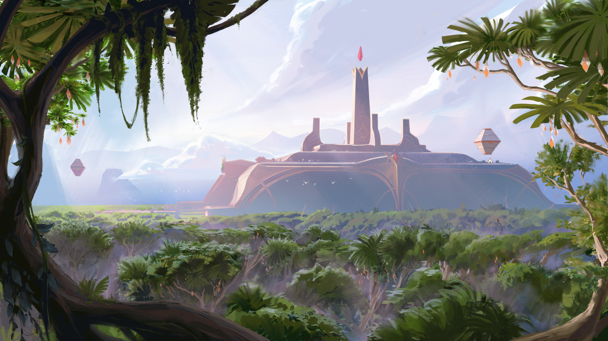
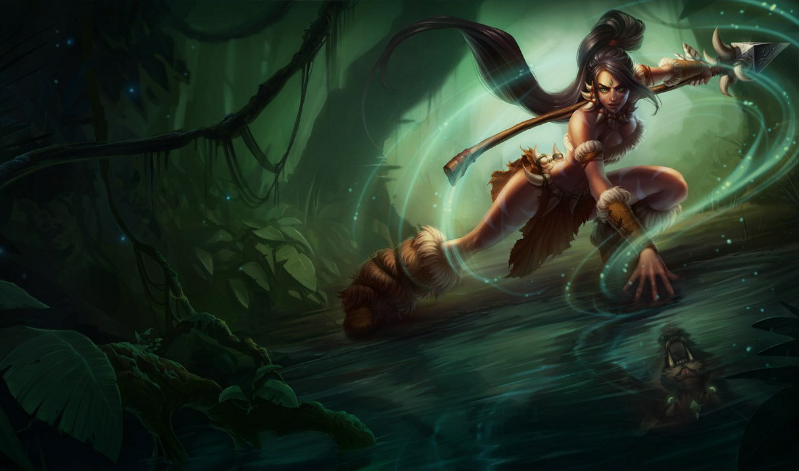
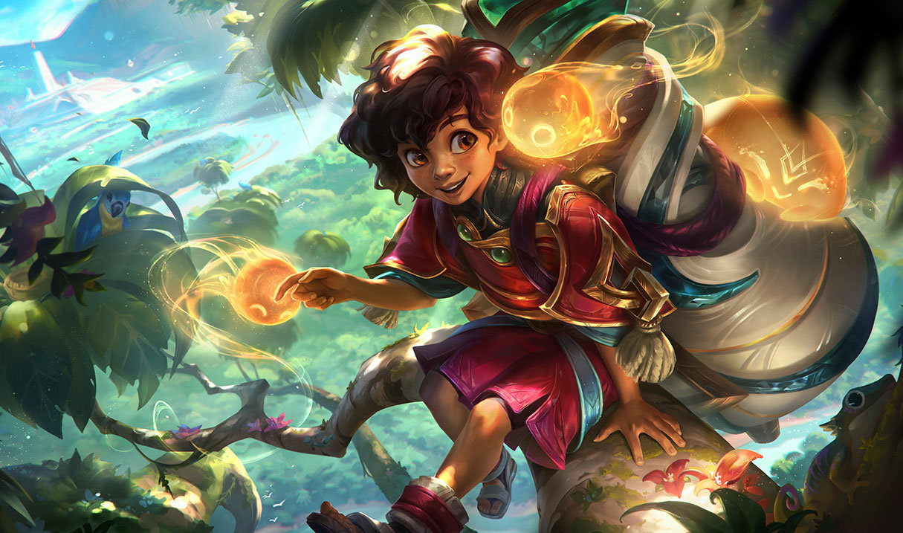
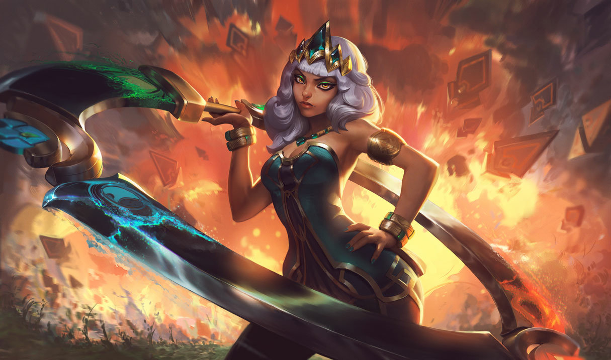

# Ixtal

Created: January 28, 2026 10:33 PM

### Ixtal (Autocrazia Magica)

<aside>

### Città Capitale:

Ixaocan

</aside>

---

### Quick menu

[Arcologia cardinale](Ixtal%202f60274fdc1c80aa8868ccc41d48e8ec.md)

[Arcologia magmatica](Ixtal%202f60274fdc1c80aa8868ccc41d48e8ec.md)

[Arcologia dell’acqua](Ixtal%202f60274fdc1c80aa8868ccc41d48e8ec.md)

Rinomata per la sua padronanza della magia elementale, Ixtal fu una delle prime
nazioni indipendenti a sorgere dopo l’Impero di Shurima. In verità, la cultura ixtali è
molto più antica, parte della grande civiltà che un tempo dominava vaste regioni,
includendo Buhru, frammenti di Helia e gli asceti del Monte Targon. È probabile che
Ixtal abbia avuto un ruolo significativo nella creazione dei primi Ascesi. I maghi di Ixtal
sopravvissero al Vuoto e, in seguito, ai Darkin, isolandosi dai popoli vicini e usando la
natura selvaggia come scudo. Sebbene molti abbiano già lasciato queste terre, alcuni
rimangono ancora oggi profondamente legati alla preservazione di ciò che resta.
Protetta dalla giungla per migliaia di anni, ora la città isolata di Ixaocan resta in gran
parte al di fuori delle influenze esterne. Avendo assistito da lontano alla rovina delle
Terre Benedette e alle Guerre delle Rune, gli Ixtali vedono il resto di Aetherion come
usurpatori e pretendenti, e utilizzano la loro potente magia per tenere lontani intrusi e
invasori.

---

# FAZIONI

Protette da **giungle impenetrabili** e da un’antica **magia naturale**, le terre di Ixtal rimangono chiuse e nascoste alla maggior parte di Aetherion.

Molti stranieri vedono la regione come una **selvaggia landa desolata**, abitata solo da fauna pericolosa e vegetazione incontrollata.

In verità, la civiltà di **Ixtal** è tra le più antiche di Runeterra, rivaleggiando con il **defunto impero di Shurima**.

Per migliaia di anni, gli Ixtali hanno praticato un **isolamento estremo**, sopprimendo ogni prova della loro esistenza.

Sviluppando e utilizzando una vasta tradizione di **magia elementale**, Ixtal ha respinto invasori, messo a tacere esploratori e mantenuto una **totale autonomia**.

Ogni aspetto della vita ixtali ruota attorno alla **natura**, unito a una **rigida gerarchia sociale** basata sulle caste.

L’architettura della loro città centrale, **Ixaocan**, integra la giungla stessa nelle costruzioni.

Le loro scuole di apprendimento sono **collegi di magia**, ciascuno dedicato a un elemento specifico (vedi le fazioni di Ixtal più sotto).

Infine, il loro sistema di credenze principali **venera il mondo materiale** e incoraggia il suo **controllo consapevole**.

### **Ixtal a colpo d’occhio**

**Demonimo:**  Ixtali

**Descrizione:** Giungle orientali pericolose

**Governo:** Autocrazia magica

**Terreno:**  Foresta pluviale tropicale

**Lingue:** Va-Nox, Ixtali, Vastayano

**Miti:** **Axiomata**

**Livello tecnologico:** Sconosciuto (alchemico)

**Atteggiamento verso la magia:** Controllo

---

### **Arcologia Cardinale**

---

> *“Vittoria per i nostri alleati, sconfitta per i nostri nemici, e giustizia per tutti.”*
> 

Situata nella città di **Ixaocan**, l’**Arcologia Cardinale** è il principale centro di **autorità e arcano** tra gli Ixtali.

Qui risiede la **casta suprema e il potere governante** di Ixtal, nota come **Yun Tal**.

Al di sotto di loro, **sciamani studenti, medium e stregoni** studiano l’uso della magia elementale.

All’interno dell’Arcologia Cardinale si trova il

**Vidalion**, un luogo dove solo gli studenti più

**dotati e talentuosi** possono dimostrare il proprio valore.

È uno dei rari spazi in cui è possibile **muoversi tra le caste sociali**: superare una prova nel Vidalion può giustificare l’ingresso nello **Yun Tal**.

### **Credenze**

1. Il mondo naturale è la nostra **salvezza** e la nostra **arma**
2. Il **Nasiana**, il Mondo Oltre, è la nostra **più grande minaccia**
3. Dobbiamo adottare **qualsiasi misura necessaria** per nascondere e proteggere la nostra patria

**Allineamento:** Legale Neutrale

**Alleati:** Arcologia Magmatica; Arcologia dell’Acqua

**Nemici:** Invasori di Ixtal

### Obiettivi

- Formare studenti nell’arte della magia elementale;
- Continuare a **celare l’esistenza di Ixaocan**

---

### **Arcologia Magmatica**

---

**Allineamento:** Legale Neutrale

**Alleati:** Arcologia Cardinale; Arcologia dell’Acqua

**Nemici:** Invasori di Ixtal

### Obiettivi

- Coltivare studenti nella magia elementale;
- Mantenere segreta l’esistenza di Ixaocan

Istituto situato nelle**catene montuose di Ixtal**, l’**Arcologia Magmatica** è specializzata nello studio della **magia del fuoco, della terra e del magnetismo**.

È più piccola rispetto agli altri collegi.

### **Credenze**

1. Il mondo naturale è la nostra salvezza e la nostra arma
2. Il Nasiana, il Mondo Oltre, è la nostra più grande minaccia
3. Dobbiamo fare tutto il necessario per nascondere e proteggere la nostra patria

---

### **Arcologia dell’Acqua**

---

Lungo il **Fiume Serpentino** sorge l’**Arcologia dell’Acqua**, dove si addestrano **elementalisti** nella magia dell’**acqua, del ghiaccio e del vapore**.

### **Credenze**

1. Il mondo naturale è la nostra salvezza e la nostra arma
2. Il Nasiana, il Mondo Oltre, è la nostra più grande minaccia
3. Dobbiamo adottare ogni misura necessaria per nascondere e proteggere la nostra patria

**Allineamento:** Legale Neutrale

**Alleati:**  Arcologia Cardinale; Arcologia Magmatica

**Nemici: Invasori di Ixtal**

### Obiettivi

- Coltivare studenti nell’arte della magia elementale;
- Continuare a celare l’esistenza di Ixaocan

---