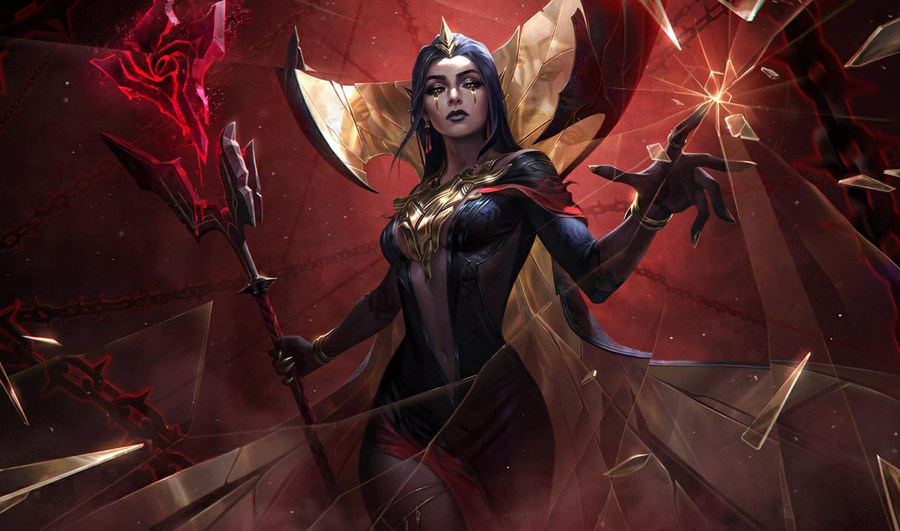
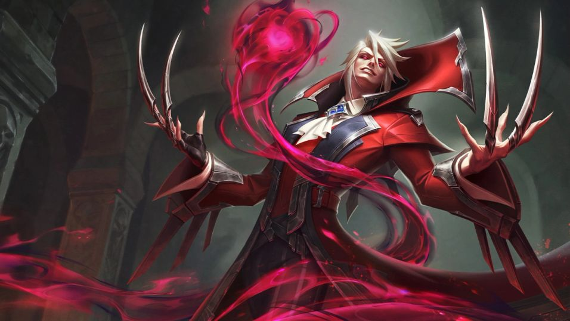
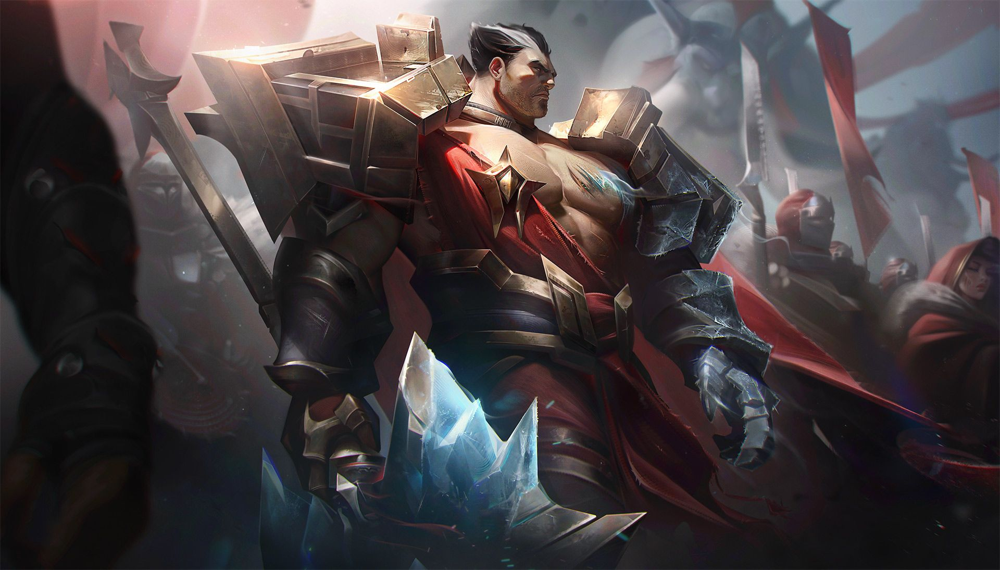
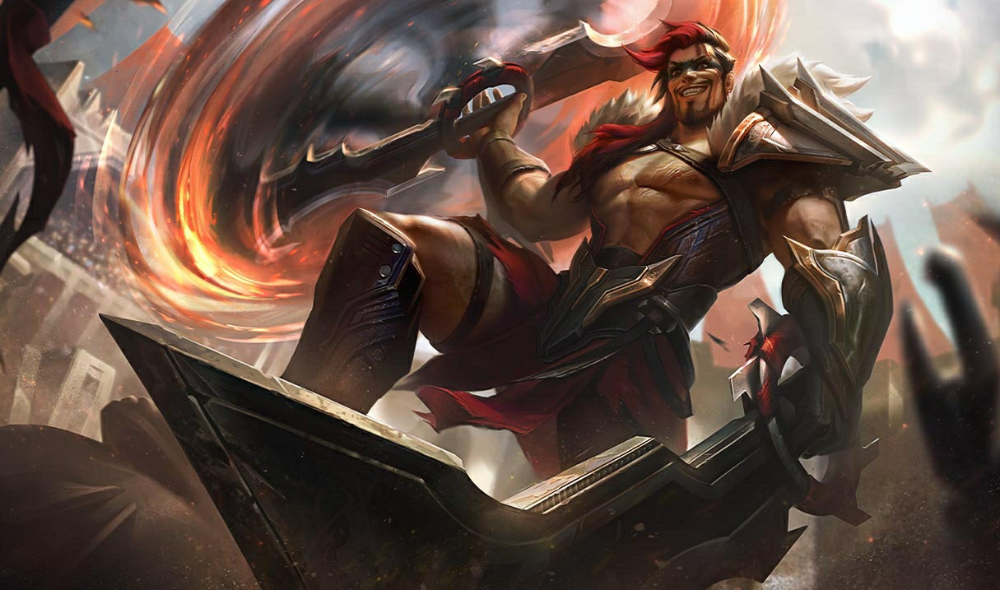

# Noxus

Created: January 28, 2026 10:34 PM

<aside>

### Città Capitale:

Noxus Prime

</aside>

---

### Quick menu

[La Rosa Nera](Noxus%202f60274fdc1c8043a828c316f4227df2.md)

[Circolo Cremisi](Noxus%202f60274fdc1c8043a828c316f4227df2.md)

[Esercito Noxiano](Noxus%202f60274fdc1c8043a828c316f4227df2.md)

[Reckoners](Noxus%202f60274fdc1c8043a828c316f4227df2.md)

### Noxus (Impero Espansionista)

.jpg)

Noxus è un impero potente dalla reputazione temibile.
Per chi vive oltre i suoi confini, Noxus è sinonimo di espansionismo, eppure al suo
interno è una società insolitamente inclusiva, dove forza e talento sono rispettati e
coltivati. Un tempo popolazione di razziatori, i Noxiani hanno trasformato l’antica città
che ora è il cuore del loro impero. Circondata da minacce su ogni fronte, Noxus ha
reagito con aggressiva determinazione, spingendo i propri confini sempre più lontano
ogni anno. Questa lotta per la sopravvivenza ha reso i noxiani straordinariamente
resilienti, capaci di trarre forza anche dalle difficoltà più profonde. Chiunque può salire
al potere e ottenere rispetto a Noxus se dimostra il giusto valore, indipendentemente
da origini, status sociale, patria o ricchezza.

---

# FAZIONI

Nazione che valorizza **ferocia, forza e dominio**, **Noxus** porta la guerra ai suoi nemici e alimenta l’orgoglio del proprio popolo.

La storia noxiana di invasioni e conquiste si estende per **migliaia di anni** e continua ancora oggi. Tra le tensioni con **Demacia** a ovest, gli insediamenti in **Shurima** a sud e i precedenti spargimenti di sangue con **Ionia** a est, Noxus vanta **l’esercito più vasto di Aetherion**.

La cultura noxiana ammira anche**merito e talento**: ogni posizione di potere nell’Impero può essere conquistata dimostrando il proprio valore e scalando i ranghi,**indipendentemente da origine personale o sociale**.

### **Demacia colpo d’occhio**

**Demonimo:** Noxiano

**Descrizione:** Impero espansionista brutale

**Governo:** Impero espansionista (legislature e stewardships)

**Terreno:** Steppe inospitali

**Lingue:** Va-Nox

**Miti:** **Kindred** (Agnello & Lupo)

**Livello tecnologico:** Medio

**Atteggiamento verso la magia:** Arma

---

### **La Rosa Nera**

---

> *“La Rosa Nera fiorirà ancora.”*
> 

L’esercito di Demacia è il **paradigma nazionale di giustizia, onore e moralità**.

Rappresenta uno dei pilastri centrali della civiltà demaciana ed è incaricato di:

- proteggere la **monarchia** e le **famiglie nobili**;
- reprimere i **maghi** che potrebbero minacciare il trono;
- difendere il territorio da **invasioni esterne**.

Tutti i cittadini abili al servizio devono prestare **almeno tre anni** nell’esercito.

All’interno delle forze armate esistono **rami specializzati ed élite**, ciascuno con missioni specifiche:

- l’**Avanguardia Impavida** è la divisione più prestigiosa, incaricata degli obiettivi più pericolosi o cruciali per Demacia;
- I Ranger **Demaciani** operano come agenti di intelligence esterna, infiltrandosi oltre le linee nemiche per **spiare o eliminare** minacce ostili.

L’organizzazione più **esoterica** di Noxus, e forse di tutta Aetherion, la **Rosa Nera** manipola la politica noxiana **dalle ombre**.

Più antica persino di Noxus stesso, la Rosa Nera si occupa solo degli **intrighi più elevati** degli affari imperiali.

Gli **arcanisti della magia nera** eseguono la volontà della **matrona della Rosa Nera**.

La maggior parte dei membri **non conosce il suo nome, il suo aspetto o la sua storia**.

La cabala opera tramite **inganno, sotterfugio, suggestione e sfruttamento nel tempo**.

Seduce nobili con ricchezze o ufficiali militari con potere, nutrendosi delle **dinamiche di potere in continuo mutamento** di Noxus e dell’ambizione del suo popolo.

I legami della Rosa Nera con il potere sono **difficili da individuare**, tanto sono intrecciati nella formazione stessa di Noxus e del suo trono.

Negli ultimi anni, tuttavia, la leadership di Noxus si è **allontanata** dalle apparenti intenzioni della Rosa Nera.

**Jericho Swain** ha rovesciato il Gran Generale **Boram Darkwill**, un burattino dei piani della Rosa, e ha fondato il**Trifarix**.

Il Trifarix mira a un potere più **bilanciato e responsabile**, il che potrebbe **contraddire gli obiettivi** della Rosa Nera… se la sua matrona non troverà un modo per piegarli alla propria volontà.

### **Credenze**

1. Noxus è il **vero e unico** seggio del potere
2. Operiamo nel segreto e nel sabotaggio **dalle ombre**
3. Burattini e figure di facciata possono servire i nostri scopi e prendersi la colpa

**Allineamento:** Neutrale Malvagio

**Alleati:** **Circolo Cremisi**; alcune case nobili noxiane; alcuni comandanti dell’esercito (alleanze **personali**, non istituzionali)

**Nemici:** **Il Trifarix**

### Obiettivi

- Servire i capricci e gli intrighi della nostra matrona fondatrice;
- Usare le figure più potenti di Noxus per il nostro tornaconto; estendere l’influenza della Rosa Nera **oltre i confini di Noxus**

---

### **Il Circolo Cremisi**

---

**Allineamento:** Neutrale Malvagio

**Alleati:** **La Rosa Nera** (per ora, poiché Vladimir ne è un patrono)

**Nemici:** **Il Trifarix**

### Obiettivi

- Servire i capricci e i complotti del nostro patrono fondatore;
- Continuare l’arte dell’**emomanzia**

> *“Uno soffre, un altro prospera.”*
> 

Circolo di **socialite noxiani**, il **Circolo Cremisi** segue **Lord Vladimir**.

Figura pubblica carismatica e anfitrione raffinato, Vladimir anima pettegolezzi e ricevimenti dell’alta società.

Sotto la sua tutela, il Circolo pratica l’**emomanzia**, la **magia del sangue**.

Alcuni considerano il Circolo una **setta**, definizione non lontana dalla verità, visti i rituali sanguinari e l’ossessiva lealtà verso Vladimir.

### **Credenze**

1. Lord Vladimir è l’apice della **nobiltà noxiana**
2. L’emomanzia è la nostra **arte venerabile** e la nostra linfa vitale
3. Manteniamo un volto pubblico rispettabile, ma il nostro **vero lavoro** si svolge nell’oscurità

---

### **L’Esercito Noxiano**

---

> *“Forti per sempre.”*
> 

L’esercito più **aggressivo ed espansionista** di tutta Aetherion appartiene a **Noxus**.

Finché si è **leali e devoti** alla macchina bellica noxiana, **chiunque può arruolarsi** e scalare i ranghi.

Sebbene molti soldati gioiscano della brutalità e della ferocia della guerra, l’esercito noxiano è anche una delle forze

**più organizzate e coordinate**

del mondo.

Esistono numerosi rami militari, ciascuno con diversi livelli di autorità. Di seguito è riportata una tabella che descrive

**ranghi, titoli e branche**

dell’esercito.

### **Credenze**

1. Tutti sono uguali nell’armata di Noxus
2. La guerra è il nostro modo di dimostrare la nostra forza
3. Arrendersi è accettabile solo come ultima risorsa

**Allineamento:** Legale Malvagio

**Alleati:**  Colonie shurimane e ioniane

**Nemici: Bilgewater; Demacia; Freljord; Ionia**

### Obiettivi

- Condurre guerre per conquistare territori per Noxus;
- Arruolare nuove persone nell’esercito noxiano.

---

### **Reckoners**

---

**Allineamento:** Caotico Neutrale

**Alleati:** Variabili (dipendono dal singolo Reckoner)

**Nemici:** Variabili (dipendono dal singolo Reckoner)

### Obiettivi

- Combattere fino alla morte nelle fosse gladiatorie

> *““Il sole è alto, la folla è pronta… combattiamo!”*
> 

La forma di intrattenimento **più sanguinosa e popolare** di Noxus sono le sue famigerate **arene di combattimento**.

I **Reckoners** sono gladiatori che combattono per la propria vita in scontri **senza esclusione di colpi**.

Alcuni Reckoners combattono **per scelta**, in cerca di fama, fortuna o per esibire le proprie abilità.

Altri vengono **costretti nelle arene** come punizione per gravi crimini contro Noxus, come ribellione o tentata diserzione.

Qualunque sia il motivo per cui entrano nell’arena, **solo il sangue e la vittoria permettono di uscirne**.

### **Credenze**

1. Crogiolarsi nella gloria della folla
2. La forza è l’unico biglietto per la fama o la libertà
3. Violenza e spargimento di sangue servono il mio scopo

---