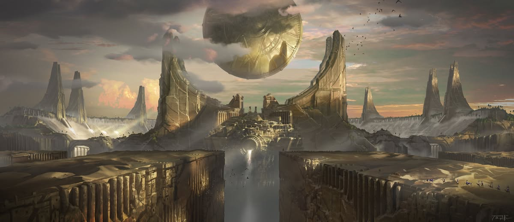
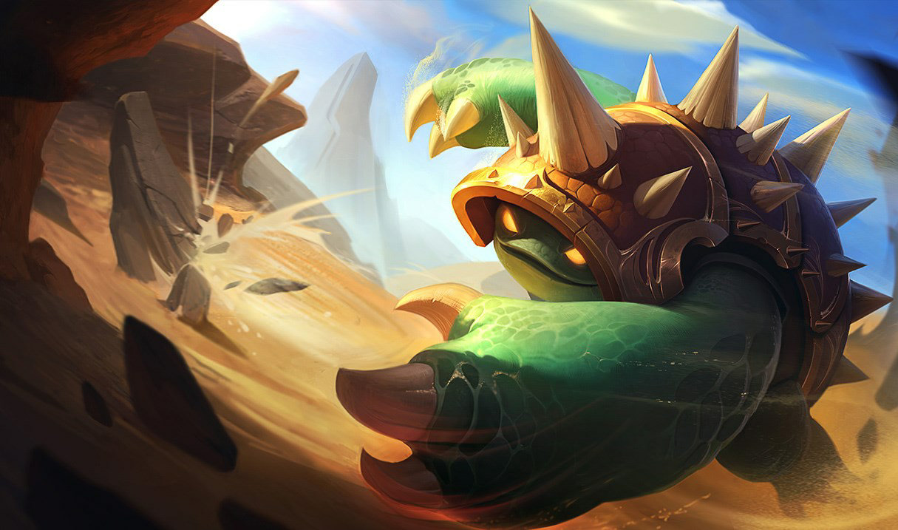
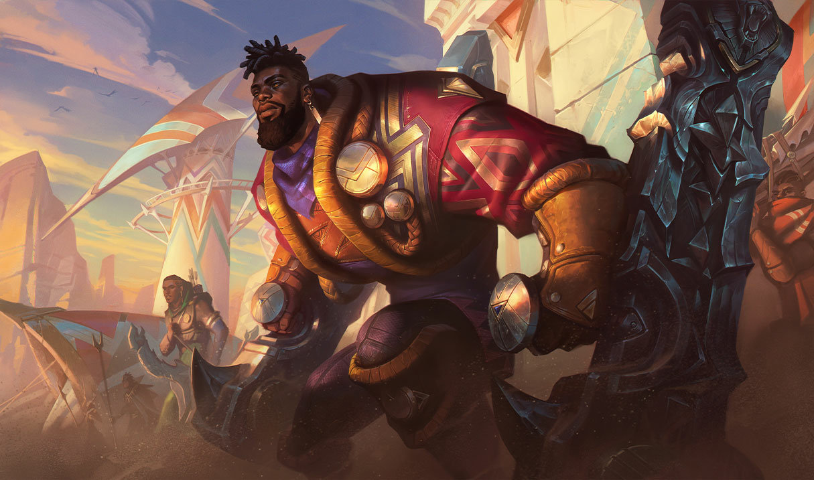

# Shurima

Created: January 28, 2026 10:34 PM

<aside>

### Città Capitale:

Il Disco Solare

</aside>

---

### Quick menu

[Discepoli dell’armadillo](Shurima%202f60274fdc1c8098a030d27006816448.md)

[**Figli di Bel’Zhun**](Shurima%202f60274fdc1c8098a030d27006816448.md)

### Shurima (Impero Divino)

Un tempo fiorente civiltà che si estendeva su vaste distese desertiche, l’Impero di
Shurima, dopo un’era di crescita e prosperità, crollò lasciando dietro di sé rovine
scintillanti. Nel corso dei millenni, i racconti delle glorie di Shurima sono diventati mito
e religione tra i discendenti dispersi del suo popolo. Oggi, la maggior parte degli abitanti
nomadi di Shurima lotta per la sussistenza in una terra dura e implacabile. Alcuni
difendono piccoli avamposti attorno a rare oasi, altri cercano ricchezze sepolte tra le
rovine dell’antico impero, o si dedicano al mercenariato, scomparendo poi di nuovo tra
le sabbie. Tuttavia, nuove voci si agitano nel cuore del deserto: la città di Shurima è
rinata.

---

# FAZIONI

L’Impero di **Shurima**, al suo apice migliaia di anni fa, fu la più grande potenza imperiale che abbia mai governato Aetherion. Grazie al potere del grande **Disco Solare**, a un esercito di **Ascesi** e a un’antica famiglia reale, l’Impero Shurimano sembrava intoccabile. Eppure, Shurima collassò dall’interno, portando alla propria rovina. L’ultimo imperatore, **Omah Azir**, fu tradito e ucciso dal suo più fidato compagno.

Il **Vuoto**, introdotto ad Aetherion durante una ribellione della città-stato di **Icathia**, corrompeva le menti persino dei più grandi guerrieri shurimani. Gli Ascesi finirono per combattere gli uni contro gli altri nella **Guerra contro i Darkin**, uno dei conflitti più catastrofici che il mondo abbia mai conosciuto.

L’Impero non si riprese mai. Al suo posto, nel corso dei secoli, innumerevoli tribù sorsero e caddero. Oggi Shurima ospita una vasta varietà di popoli, governi e clan. La cultura shurimana ruota attorno al commercio e al viaggio, poiché i deserti aridi offrono ben poco sostentamento.

Predoni e razziatori prosperano nelle terre dure e tra le rovine antiche. Oltre i confini della civiltà, le distese disabitate di Shurima celano storie mai raccontate e pericoli ineguagliabili. Creature e mostri si muovono sotto le sabbie, pronti a divorare esploratori ignari. I resti fatiscenti dell’antico impero custodiscono tesori e trappole di ere passate.

Nonostante la sua caduta, l’epoca gloriosa di Shurima non è del tutto dimenticata. Si mormora di una miracolosa resurrezione dell’ultimo imperatore shurimano, forse presagio di una nuova era per Shurima.

### **Piltover a colpo d’occhio**

**Demonimo:** Shurimano

**Descrizione:** Impero desertico caduto

**Governo:** Impero divino

**Terreno: Deserto arido**

**Lingue:** Va-Nox, Shurimano, Targonian, Vastayano

**Miti:** Ascesi, la Grande Tessitrice, Kindred (Agnello e Lupo), Rammus, il Vuoto

**Livello tecnologico:** Sconosciuto

**Atteggiamento verso la magia:** Bramata

---

### **Discepoli dell’Armadillo**

---

> *“Rammus sia con me, ti prego.”*
> 

I miti criptici che circondano l’**Armadillo chiamato Rammus** si sono diffusi in tutta Shurima, diventando leggende tra bambini, filosofi e sacerdoti. Alcuni credono che Rammus sia un dio antico e inconoscibile. Altri lo considerano una creatura benevola, portatrice di fortuna e prosperità.

In ogni caso, Rammus ha accumulato un enorme seguito e una mitologia imponente. La città shurimana di **Nashramae** ospita un festival annuale in suo onore, durante il quale i fedeli rotolano imitando l’Armadillo.

### **Credenze**

1. L’Armadillo è un dio grande e potente.
2. L’Armadillo ci Protegge dai pericoli del deserto
3. Nel dubbio, prega Rammus

**Allineamento:** Neutrale Puro

**Alleati:** Nessuno

**Nemici:** Nessuno

### Obiettivi

- Venerare e onorare **Rammus, l’Armadillo**

---

### **Figli di Bel’Zhun**

---

**Allineamento:** Caotico Buono

**Alleati:**  Clan Medarda di Piltover

**Nemici:  Noxus**

### Obiettivi

- Resistere e rimuovere l’influenza noxiana da Bel’Zhun;
- Armare i cittadini di Bel’Zhun contro il dominio noxiano.

> *“Non scambieremo il giogo di un impero con quello di un altro.”*
> 

Bel’Zhun era una città portuale shurimana prima della sua occupazione e annessione da parte di **Noxus**. Oggi è un centro commerciale e logistico noxiano, fondamentale per alimentare la macchina da guerra dell’impero.

Tuttavia, una ribellione crescente di cittadini di Bel’Zhun, che si fanno chiamare i **Figli di Bel’Zhun**, resiste al controllo di Noxus. Si tratta di un gruppo militante, che sfida apertamente l’autorità noxiana a ogni occasione.

### **Credenze**

1. Noxus è una piaga sulla nostra città.
2. Se gli invasori usano la violenza, risponderemo allo stesso modo.
3. Prima vengono i nostri fratelli dei Figli di Bel’Zhun, poi il sole che splende su Shurima.

---