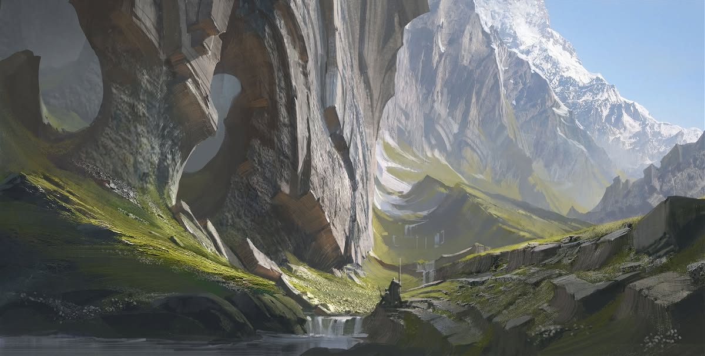
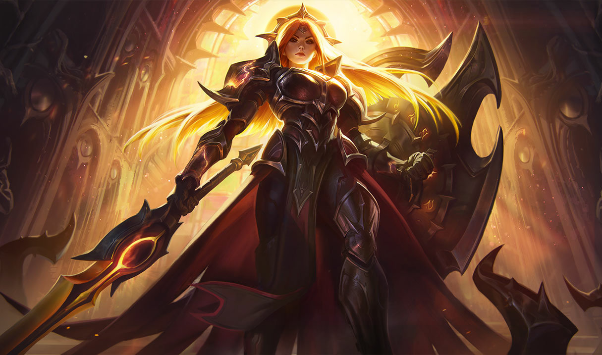
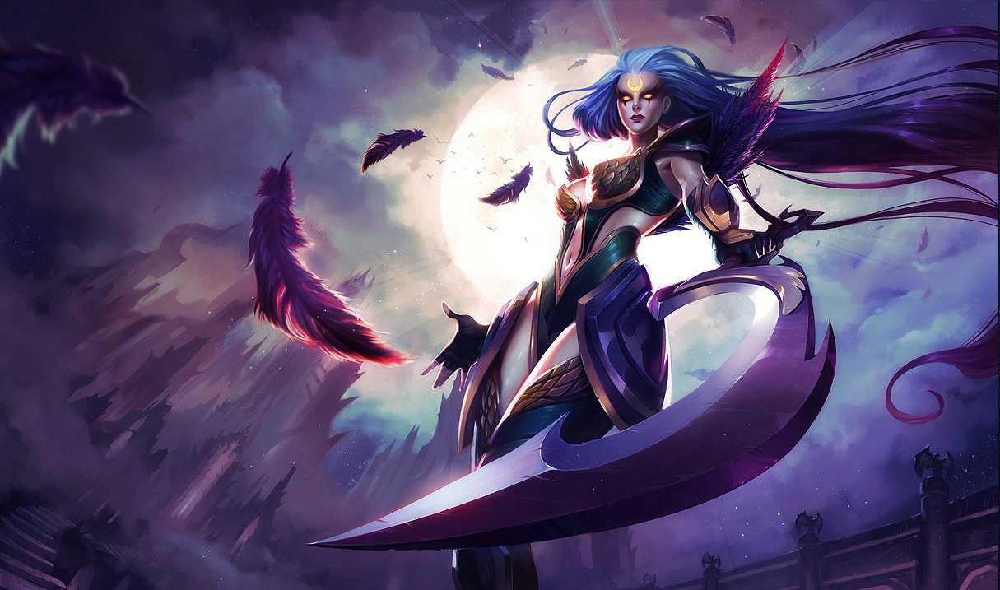

# Targon

Created: January 28, 2026 10:35 PM

### Targon (Teocrazia Tribal)

<aside>

### Città Capitale:

Città dell’Oro e dell’Argento

</aside>

---

### Quick menu

[Solari](Targon%202f60274fdc1c8007aa94fd5b10def99c.md)

[Lunari](Targon%202f60274fdc1c8007aa94fd5b10def99c.md)

[MITOLOGIA](Targon%202f60274fdc1c8007aa94fd5b10def99c.md)

Come ogni mito, il Monte Targon è un faro per sognatori, folli e determinati.
Regione montuosa e scarsamente abitata a ovest di Shurima, Targon ospita la vetta più
alta di Aetherion. Lontano dalla civiltà, il Monte Targon è quasi impossibile da
raggiungere, ma attrae inermi pellegrini che inseguono un desiderio profondo di
toccarne la cima. Coloro che sopravvivono all’ardua scalata raramente tornano come
erano: alcuni emergono con corpi trasfigurati, portando il segno del sole e della luna;
altri acquisiscono conoscenze insondabili, diventando custodi di segreti antichi. Molti
tornano spezzati e tormentati, oppure cambiati oltre ogni riconoscimento. Gli abitanti
dei villaggi ai piedi della montagna credono che questi siano diventati Aspetti di entità
celestiali ormai scomparse, esseri antichi e potenti su scala che va oltre la
comprensione umana. Tuttavia, il Monte Targon è solo una finestra sul reame
celestiale, e sarebbe un errore attribuire troppo peso alle sensibilità mortali, alle morali
o alle preoccupazioni di ciò che si cela oltre la montagna.

---

# FAZIONI

Celestiale, radioso, sacro: il **Monte Targon** è un luogo di profonda spiritualità e mito. La sua vetta imponente è oggetto di grande interesse ed esplorazione; viaggiatori e abitanti cercano di scalarne le pendici impervie. Considerata la prova suprema del carattere di una persona o un mezzo per entrare in comunione con i **Celestiali** che si dice abitino il suo punto più alto, la scalata del Targon è una prova mortale, ma ricca di ricompense.

Targon è, di per sé, un luogo santo di pellegrinaggio e venerazione. Le tribù, l’architettura e le religioni di Targon ruotano attorno al culto dei corpi celesti che circondano il monte. La tribù principale di Targon è quella dei **Rakkor**, un popolo resiliente e devoto. Essi seguono in maggioranza la fede dei **Solari**, adoratori del Sole. Nell’ombra della montagna, costretti alla segretezza, si trovano invece i **Lunari**, adoratori della Luna.

Ogni aspetto della vita targoniana richiede perseveranza. Le fredde montagne sono un luogo ostile da chiamare casa. Animali pericolosi si aggirano tra colline e valli, incuranti della presenza umana. Gli scontri tra Solari e Lunari sono rari, ma violenti, e rivelano un profondo rancore reciproco. Di conseguenza, i Targoniani tendono a essere**insulari**, protettivi e fortemente devoti a sé stessi e ai propri ideali.

### **Targon a colpo d’occhio**

**Demonimo:** Targoniano

**Descrizione:** Catene montuose occidentali estese

**Governo:** Teocrazia tribale

**Terreno:** Montagne aspre

**Lingue:** Va-Nox, Demaciano, Shurimano, Targoniano, Vastayano

**Miti:** Celestiali (Aspetti)

**Livello tecnologico:** Basso

**Atteggiamento verso la magia:** Aspirazione

---

### **Solari**

---

> *“Il sole sorge sempre.”*
> 

Nella luce abbagliante del giorno, i **Solari** consacrano la loro intera esistenza all’onore del **Sole**. Da quando il sole splende su Aetherion, sacerdoti e fedeli Solari ne hanno venerato il potere che dona la vita.

I Solari vantano un grande ordine di guerrieri, chiamato **Ra’Horak** o **Seguaci dell’Orizzonte**. Essi sono devoti alla protezione del Monte Targon, al sostegno dei poveri e degli afflitti, e alla repressione dell’eresia. Il loro principale nemico sono i Lunari, il cui culto della luna è considerato nient’altro che una falsa idolatria: i Solari sanno che la vera illuminazione proviene dal sole.

**Leona**, Aspetto del Sole, guida i Solari come paladina di luce e forza. I Ra’Horak rispondono inoltre al loro comandante militare, il soldato

**Rahvun**.

### **Credenze**

1. Il male viene annientato dal potere divino del sole.
2. Così come il sole splende con luce aperta e senza scuse, anche i Solari devono agire apertamente.
3. Come il sole crea la vita, noi provvediamo a tutti i membri della nostra società.

**Allineamento:** Legale Neutrale

**Alleati:** Nessuno

**Nemici:** Lunari

### Obiettivi

- Venerare il Sole radioso;
- Difendere il Monte Targon da danni e invasioni;
- Sopprimere l’eretica e falsa fede dei Lunari.

---

### **Lunari**

---

**Allineamento:** Caotico Neutrale

**Alleati:** Nessuno

**Nemici:** Solari

### Obiettivi

- Venerare la luna tenebrosa; proteggere le terre e le credenze dei Lunari;
- Resistere alla persecuzione dei Solari ignoranti.

> *“Non seguire nessuna falsa luce.”*
> 

Sotto il manto della notte si ergono i **Lunari**, un gruppo che venera il potere celestiale della **Luna**.

Si dice che, secoli fa, i Lunari praticassero il loro culto apertamente. Tuttavia, l’ostilità e la sottomissione imposte dai **Solari** li hanno condannati all’oscurità. I Lunari hanno così trovato rifugio nelle tenebre, abitandone i recessi del Monte Targon: profonde caverne e antichi santuari dimenticati. Dall’ombra, i Lunari sono disposti a ricorrere a metodi segreti come **assassinio** e **spionaggio** per difendere le proprie credenze.

Forse il ramo più vitale dei Lunari è costituito da **veggenti e oracoli**. Attraverso magia spirituale ed energie tratte dalla luna, i veggenti Lunari cercano di profetizzare il futuro e di recuperare il passato che i Solari hanno cancellato.

La guida spirituale dei Lunari è **Diana**, l’Ascendente che rappresenta l’Aspetto della Luna. Tra i leader militari più noti dei Lunari vi è **Cygnus**, che dirige un’élite di assassini.

### **Credenze**

1. La luna è la nostra fonte di potere e guida.
2. Ogni Lunare ha il proprio cammino da trovare, chiamato *orbita*.
3. La sopravvivenza dei Lunari richiede che si vegli gli uni sugli altri.

---

### MITOLOGIA

---

Le leggende targoniane parlano di **due sorelle**: la **Sorella Dorata** e la **Sorella d’Argento**, considerate le incarnazioni del sole e della luna, rispettivamente. Si dice che le sorelle combattano una guerra celestiale eterna, e che il loro conflitto sia responsabile dell’alternarsi del giorno e della notte. Tuttavia, sussurri di antiche storie, tramandate da pochissimi, affermano che le sorelle fossero un tempo **un unico essere**. 

Queste voci sostengono inoltre che Solari e Lunari un tempo venerassero in armonia, insieme.

Ma tali credenze sono considerate **pura blasfemia**.

---