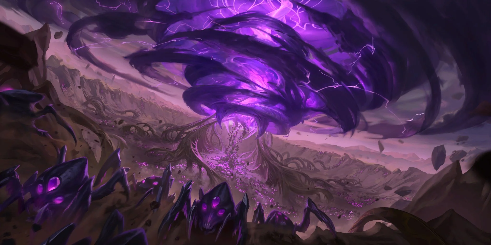

# Void

Created: January 28, 2026 10:35 PM

### Void

<aside>

### Città Capitale:

N/A

</aside>

---

Gridando la propria esistenza alla nascita dell’universo, il Vuoto è una manifestazione
dell’ignoto assoluto che giace oltre la realtà. È una forza di fame insaziabile, in attesa
che i suoi strumenti, i misteriosi Osservatori, segnino la fine di ogni cosa. Essere toccati
dal Vuoto significa soffrire una visione agonizzante della realtà ultraterrena, abbastanza
da spezzare anche le menti più forti. Gli abitanti del Vuoto sono creature costruite,
dotate di intelligenza limitata, create con uno scopo unico: consumare tutto fino
all’annientamento totale. Il Vuoto urla la sua presenza nell’esistenza sin dalla nascita
dell’universo, e attende pazientemente che i suoi emissari ne segnino la fine… e così
portare l’oblio assoluto su ogni cosa.

---

# FAZIONI

Esiste un luogo tra le dimensioni, tra i mondi. Per alcuni è conosciuto come **l’Esterno**, per altri è **l’Ignoto**. Per coloro che lo conoscono davvero, tuttavia, è chiamato **il Vuoto**.

Nonostante il nome, il Vuoto non è un luogo vuoto, ma piuttosto la dimora di cose indicibili: orrori non destinati alla mente degli uomini.

Definire il Vuoto come un piano di esistenza è, forse, fuorviante; il Vuoto è un **reame della dissoluzione**, della **non-esistenza**. Che il Vuoto sia esso stesso un’intelligenza, una massa affamata e senziente, o una cupa realtà apocalittica, non è dato saperlo. Il Vuoto consuma tutto ciò che entra in contatto con esso: un orrore accecante di abominazioni nere e violacee.

Il Vuoto filtra nel **Reame Materiale** attraverso le **Fenditure del Vuoto**. Questi portali si trovano solitamente in luoghi remoti, come gole oceaniche, lande desertiche o distese ghiacciate e desolate.