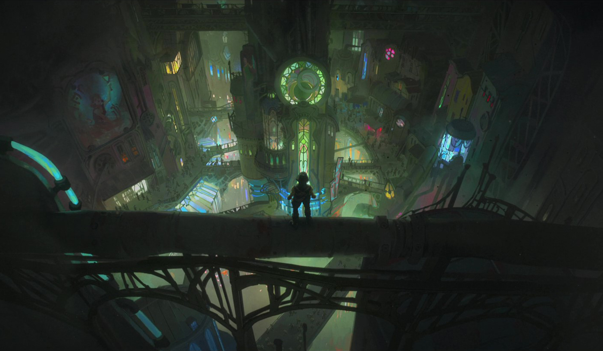
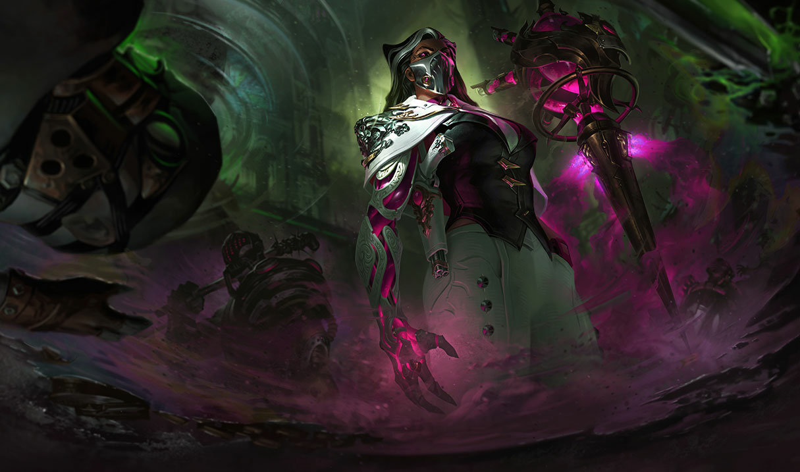
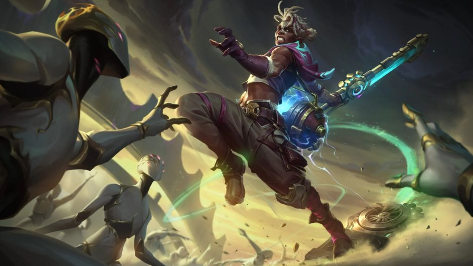

# Zaun

Created: January 28, 2026 10:35 PM

<aside>

### Città Capitale:

Zaun (Città-Stato)

</aside>

---

<aside>

### Soprannomi:

Città del Ferro e del Vetro, Città Sommersa, Undercity, Città Sotterranea,
Sottocittà Inquinata

</aside>

### Quick menu

[Gray Nails](Zaun%202f60274fdc1c8028be38ec1c3b9f9bbb.md)

[Figli perduti di Zaun](Zaun%202f60274fdc1c8028be38ec1c3b9f9bbb.md)

---

### Zaun (Oligarchia Industriale)

Zaun, nota anche come la Città del Ferro e del Vetro, è una vasta metropoli sotterranea,
incastonata nei profondi canyon e vicoli sotto Piltover. La poca luce che riesce a filtrare
dall’alto viene distorta da fumi tossici, intrecci di tubature corrose e riflessi sul vetro
macchiato della sua architettura industriale. Zaun e Piltover un tempo erano un’unica
città, ma oggi sono due società simbolicamente opposte. Zaun esiste in una penombra
perpetua: prospera nella sporcizia, mentre Piltover brilla nella luce artificiale del
progresso. Eppure, sotto la superficie, Zaun è viva e vibrante, colma di determinazione
e di odio verso la città che la sovrasta un oscuro riflesso di ciò che Piltover rappresenta.
Molti dei beni che rendono Piltover grande trovano origine proprio a Zaun: dai mercati
neri ai inventori hextech che, soffocati dalle restrizioni della città alta, trovano rifugio
qui. Lo sviluppo incontrollato di tecnologie volatili e un’industria senza scrupoli hanno
reso vaste aree di Zaun inabitate e pericolose. Fiumi di scarti tossici macchiano le zone
più basse della città… eppure, anche qui, le persone riescono a sopravvivere, adattarsi
e prosperare

---

# FAZIONI

Tra una costa brulicante di attività e rotte commerciali intrecciate, sorgono le **città-stato gemelle di Piltover e Zaun**.

I due distretti non sono collegati solo dalla vicinanza geografica, ma soprattutto da una **storia condivisa di progresso e conflitto** legata allo sviluppo dell’**hextech**.

**Piltover**, chiamata la **Città del Progresso**, è il cuore culturale del commercio e dell’industria. Luminosa e cosmopolita, Piltover si erge su alte scogliere, dove una penisola collega Valoran e Shurima. Clan mercantili e aristocratici esercitano il maggiore controllo sulla direzione della città, privilegiando **profitto e sviluppo** sopra ogni altra cosa.

Tuttavia, il progresso ha un costo che pochi piltoveriani sono disposti a riconoscere: **ricchezza e sicurezza sono privilegi di pochi**, e la grande hextech che alimenta la città genera **inquinamento e sfruttamento** al di fuori di ogni controllo reale.

**Zaun**, nota come la **Città del Ferro e del Vetro**, è il lato oscuro di una sperimentazione senza limiti e di un’evoluzione incontrollata. Situata in gole scoscese e canyon profondi, Zaun è costantemente avvolta da strati di smog e fumo.

Mercati neri, industriali spietati e sindacati criminali cercano potere e profitto tramite affari loschi. Sotto i livelli superiori della città si estende una rete di fogne e scarichi, creando un sottosuolo **inabitabile e letale**. Eppure, proprio dai vicoli di ferro emergono **menti brillanti** e una cultura di **resilienza e invenzione**.

### **Piltover a colpo d’occhio**

**Demonimo:** Zaunita

**Descrizione:** Sottocittà inquinata

**Governo:** Oligarchia industriale

**Terreno: Urbano (tossico)**

**Lingue:** Va-Nox, Piltoveriano (dialetti zauniti)

**Miti:** Chiesa del Glorioso Evoluto; Janna; Kindred (Agnello e Lupo)

**Livello tecnologico:** Alto

**Atteggiamento verso la magia:** Sfruttare

---

### **Gray Nails**

---

Una banda sgangherata e senza legge, i **Gray Nails** cercano di **fare soldi e poco altro**. Servono a turno diversi baroni chimici di Zaun, eseguendo gli ordini di chiunque li paghi di più.

Il loro nome deriva dalla **sporcizia che annerisce le loro unghie** quando maneggiano pericolosa chemtech.

### **Credenze**

1. Il disordine è l’ordine naturale di Zaun
2. Il denaro è difficile da ottenere, quindi bisogna fare qualunque cosa per averlo
3. Chi non appartiene ai Gray Nails è un ostacolo al nostro successo

**Allineamento:** Caotico Malvagio

**Alleati:** Nessuno

**Nemici:** I Figli Perduti di Zaun; Piltover

### Obiettivi

- Usare la ricchezza dei baroni chimici per sopravvivere alle strade brutali di Zaun;
- Armarci con chem-tech e giocattoli piltoveriani per mantenere attiva la fazione

---

### **Figli Perduti di Zaun**

---

**Allineamento:** Caotico Neutrale

**Alleati:**  Nessuno

**Nemici:  Piltover**

### Obiettivi

- Sopravvivere nelle strade di Zaun; proteggere il più possibile gli altri bambini zauniti da chi vorrebbe sfruttarli o ferirli;
- Trovare e usare rottami per creare strumenti hextech

> *“Nessuno può tenermi a terra.”*
> 

L’infanzia è già di per sé una prova, ma a Zaun è **molto peggio**. Un gruppo di giovani orfani zauniti, che si fanno chiamare i **Figli Perduti di Zaun**, si è unito per proteggersi a vicenda.

Il loro leader è un adolescente di nome **Ekko**, un brillante inventore che crea gadget e armi per difendere il gruppo dai sindacati criminali e dalla polizia che cerca di far loro del male.

I Figli Perduti sono **ingegnosi, scaltri e veloci**, e sopravvivono nelle strade di Zaun usando qualunque strumento o rottame riescano a trovare.

### **Credenze**

1. Gli adulti si sono dimostrati una minaccia per noi
2. Tutto ciò che ci serve per sopravvivere è dentro di noi e tra di noi
3. A volte le leggi vanno infrante per poter resistere

---