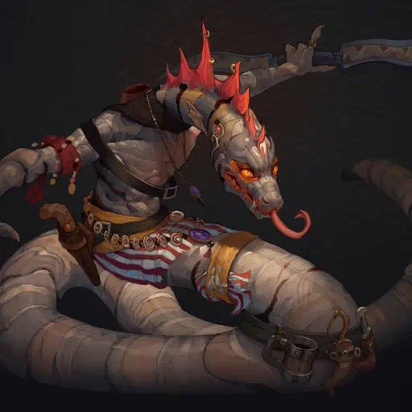

# Rejak

Text: Porto

Descrizione: Braccio destro di Hector, veste rispetto al suo Capitano in maniera più umile, da autentico marinaio, è molto gracile per la sua specie, è probabilmente quello più debole dei quattro membri originali della banda. Adora un sacco gli animali esotici e le creature marine, piccole o grandi che siano.

PROVENIENZA: Bilgewater, ha perso i suoi genitori nel mentre, cari amici del suo Capitano

Altezza: 1.79

Carattere: Ha fifa spesso dei combattimenti cruenti, addomestica gli animali suoi preferiti, i coccodrilli, i suoi teneri cuccioli che li tratta come figli suoi. E' molto intuitivo e suggerisce spesso lui le cose: per quanto non abbia fegato viene trattato nella maggiorparte dei casi bene, a parte quando inizia a piangere.