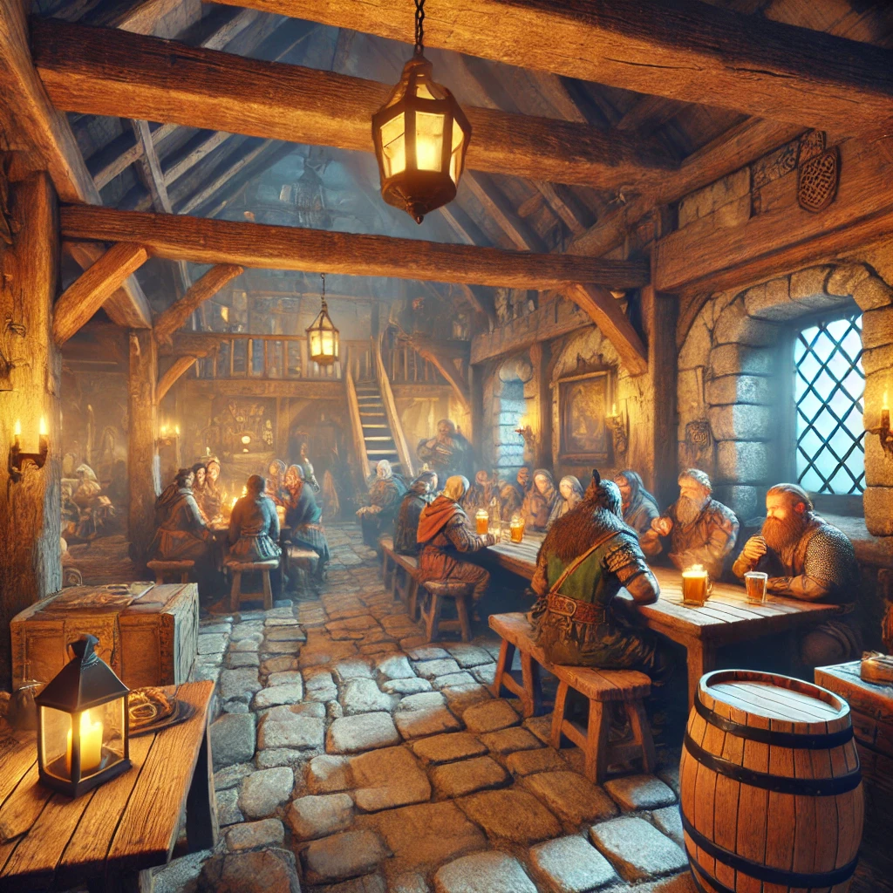

# Locanda

Un silenzio avvolge un luogo tanto sacro e pieno di storia. Non fare rumore, il capo dello staff non ci va piano con chi disturba la quiete.

"Mh, cosa serve? I prezzi li vedi sui cartelli"

Esposti, vari cartelli

```
- Una stanza per un mese costa 10gp
- Un pasto costa 1gp
- Per gli alcolici, 3sp un bicchiere / 5gp una bottiglia

```

```
 "Se sei avventuriero o un membro del nostro staff, 5gp al mese per vitto ed alloggio. 
 Gli alcolici sono esclusi!"

```

Essendo la Locanda parte dello stesso edificio, in caso i posti a sedere fossero pieni, i tavoli della Gilda degli Avventurieri possono essere sfruttati per sedersi a mangiare.

## Stipendio

Lo stipendio dipende da:

A) Livello del PG

> • Apprendista (Livelli 1-5) = 15 mo base
• Professionista (Livelli 6-12) = 25 mo base
• Mastro (Livelli 13-20) = 35 mo base
> 

B) Giorni di lavoro

> • I primi 5 giorni, avrete lo stipendio base descritto nella variabile A (Chi fa meno di 5 giorni, non viene pagato);
• Successivamente, avrete stipendio extra, in base dagli stock bonus completati (5 giorni per stock, per un massimo di 4 stock bonus)
> 

C) Modificatore caratteristica del lavoro

> • Ogni lavoro ha due modificatori caratteristica tra cui scegliere, che aumenteranno il vostro stipendio.
• Per questo lavoro, sono **Destrezza (DEX)** o **Carisma (CHA).**
> 

---

